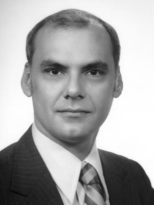
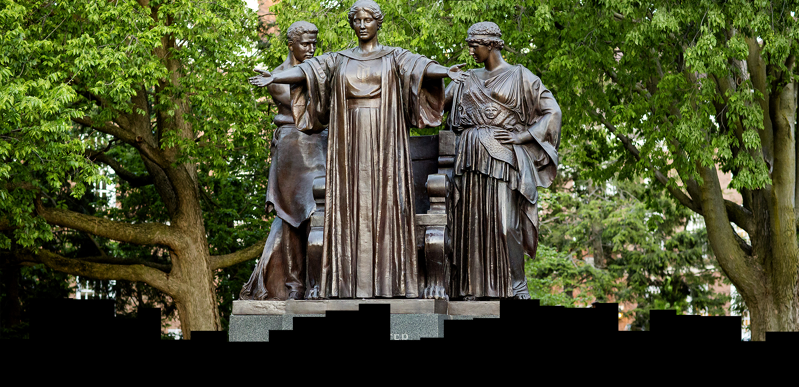
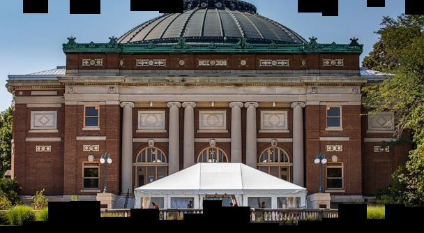
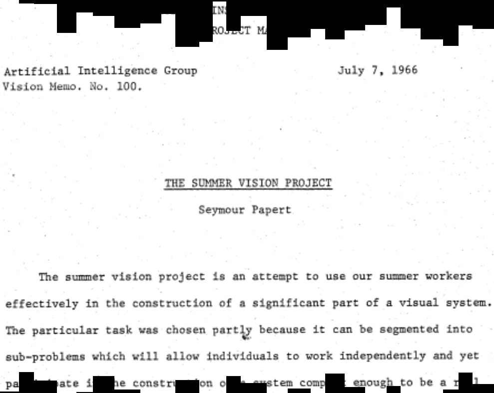
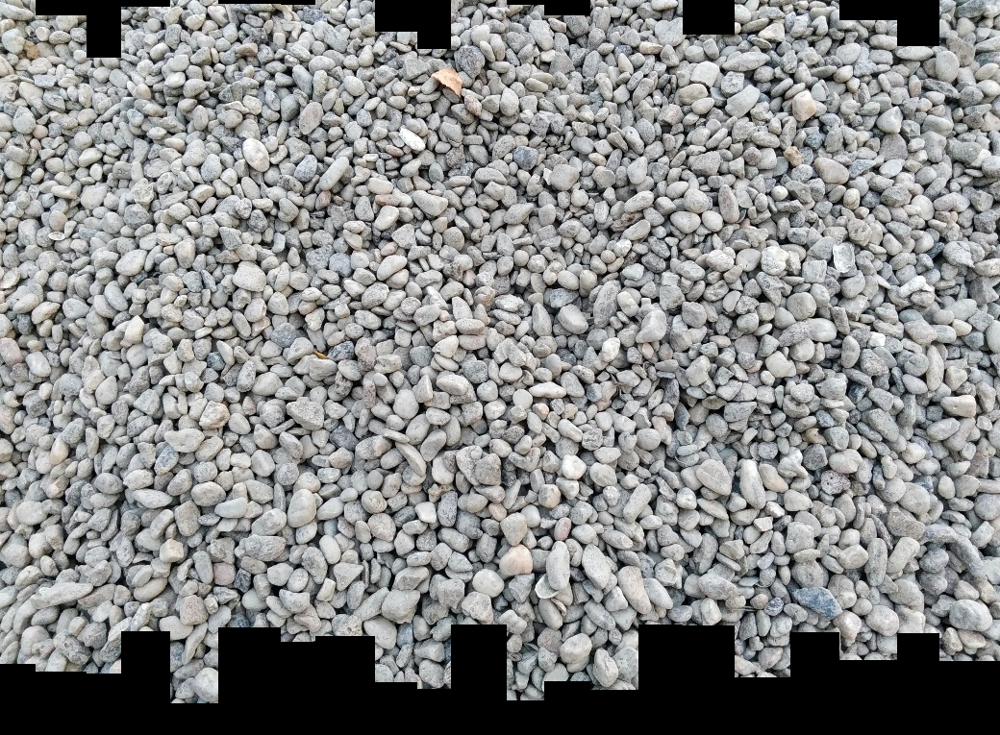

## MP0-Q3 by Jongwon Lee (jongwon5)

## Description on parameters
```
usage: main.py [-h] [--src-dir SRC_DIR] [--dst-dir DST_DIR]
               [--img-name {simple_almastatue,simple_larry-roberts,hard_almastatue,hard_texture,hard_text,hard_building}]
               [--mode {None,ssd,zncc}]

parameters for image processing

optional arguments:
  -h, --help            show this help message and exit
  --src-dir SRC_DIR     directory to read shredded images
  --dst-dir DST_DIR     directory to write concatenated image
  --img-name {simple_almastatue,simple_larry-roberts,hard_almastatue,hard_texture,hard_text,hard_building}
                        image to concatenate
  --mode {None,ssd,zncc}
                        matching method to use
```

## How to use

Before get started, please unzip this project into the directory `MP0/`, which should already include a folder `shredded-images/`.

1. To create the answer for (3.1.), please execute:

```
python main.py --img-name simple_{IMGNAME}
```

2. To create the answer for (3.2.), please execute:

```
python main.py --img-name simple_{IMGNAME} --mode ssd
```

3. To create the answer for (3.3.), please execute:

```
python main.py --img-name hard_{IMGNAME} --mode zncc
```

You may be able to see combined strips in the directory `results/`.

## Examples

Let's reconstruct the Alma Statue.

1. Combine [5 pts]

```
$ python main.py --img-name simple_almastatue 
> Namespace(dst_dir='results/', img_name='simple_almastatue', mode=None, src_dir='../shredded-images/')
> collapsed time: 0.0000 [s]
```


You may be able to see the weird combined image in an unsorted order. This has been done by simply reading all strips in the designated directory (function `_read_strips(self, src_dir)`), sort randomly (function `sort_strips_random(self)`), and combine these (function `combine_strips(self)`). 


2. Re-order [10 pts]

Now, let's sort the strips using *the sum of squared differences*.

```
$ python main.py --img-name simple_almastatue --mode ssd
> Namespace(dst_dir='results/', img_name='simple_almastatue', mode='ssd', src_dir='../shredded-images/')
> collapsed time: 0.0247 [s]
```


It seems like the strips are sorted properly. The sorting algorithm is implemented in a member function `sort_strips_ssd` of `ImgUnshredder` class. Below is the pseudocode of `sort_strips_ssd` function.

```
input : strips_unsorted, strips_sorted
goal  : move all elements from strips_unsorted to strips_sorted with a proper order.

do 
    for all strip_being_compared in strips_unsorted:
        max_nssd <- -inf
        similarest_strip <- None
        append_direction <- None
        
        if nssd(rightmost(strips_sorted), leftmost(strip_being_compared)) > max_nssd then
            max_nssd <- nssd(rightmost(strips_sorted), leftmost(strip_being_compared))
            similarest_strip <- strip_being_compared
            append_direction <- right
        else if nssd(rightmost(strip_being_compared), leftmost(strips_sorted)) > max_nssd then
            max_nssd <- nssd(rightmost(strip_being_compared), leftmost(strips_sorted))
            similarest_strip <- strip_being_compared
            append_direction <- left
        end
    end

    move similarest_strip from strips_unsorted to strips_sorted, by appending on the append_direction

until len(strips_unsorted) == 0
```

where negative SSD can be computed as below:

```
function nssd(arr1, arr2)
    return -sum(l2_norm(arr1 - arr2))
end
```

If we assume that there are n strips to be sorted, this greedy SSD algorithm as the time complexity of *O(n\*\*2)*, since it needs to compare (n-1) + (n-2) + ... + 1 strips for all iterations.

Except Alma Statue, Larry Roberts's picture as been successfully reconstructed as well.



3. Align and Re-order [15 pts]

Now let's move on to the unsorted strips with offset and try to reconstruct it based on *zero mean normalized cross correlation* algorithm.

```
$ python main.py --img-name hard_almastatue --mode zncc
> Namespace(dst_dir='results/', img_name='hard_almastatue', mode='zncc', src_dir='../shredded-images/')
> collapsed time: 160.3736 [s]
```



It seems like the strips are properly aligned sorted as well. The sorting algorithm is implemented in a member function `sort_strips_zncc` of `ImgUnshredder` class. Below is the pseudocode of `sort_strips_zncc` function.

```
input : strips_unsorted, strips_sorted, relative_offset
goal  : move all elements from strips_unsorted to strips_sorted with a proper order, while recording the relative offset between left to right strips in relative_offset.

do 
    for all strip_being_compared in strips_unsorted:
        max_zncc <- 0
        similarest_strip <- None
        similarest_offset <- None
        append_direction <- None
        
        for all offset in offset_range
            if zncc(rightmost(strips_sorted), leftmost(strip_being_compared), offset) > max_zncc then
                max_zncc <- -ssd(rightmost(strips_sorted), leftmost(strip_being_compared))
                similarest_strip <- strip_being_compared
                similarest_offset <- offset
                append_direction <- right
            else if -ssd(rightmost(strip_being_compared), leftmost(strips_sorted), offset) > max_zncc then
                max_zncc <- -ssd(rightmost(strip_being_compared), leftmost(strips_sorted))
                similarest_strip <- strip_being_compared
                similarest_offset <- offset
                append_direction <- left
            end
        end
    end

    move similarest_strip from strips_unsorted to strips_sorted, by appending on the append_direction
    add similarest_offset in relative_offset, by appending on the append_direction

until len(strips_unsorted) == 0
```

where ZNCC can be computed as below:

```
function zncc(arr1, arr2)
    sum_zncc = 0
    for n in range(size(arr1)):
        sum_zncc += (arr1[n] - avg(arr1)) * (arr2[n] - avg(arr2)) / (std(arr1) * std(arr2))
    
    return sum_zncc / size(arr1)
end
```

It takes significantly longer time than SSD algorithm. This is due to the fact that ZNCC with offset algorithm has the time complexity of *O(n\*\*2 * o)* whereas SSD has *O(n\*\*2)* (*n* : the number of strips, *o* : the pixel offset to be investigated), which may have resulted in such a significant computation burden.


Like Alma Statue, Other unsorted and misaligned images has been successfully reconstructed as well.





