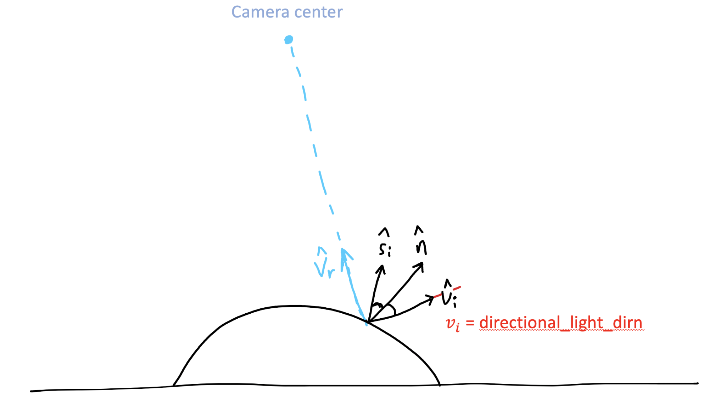
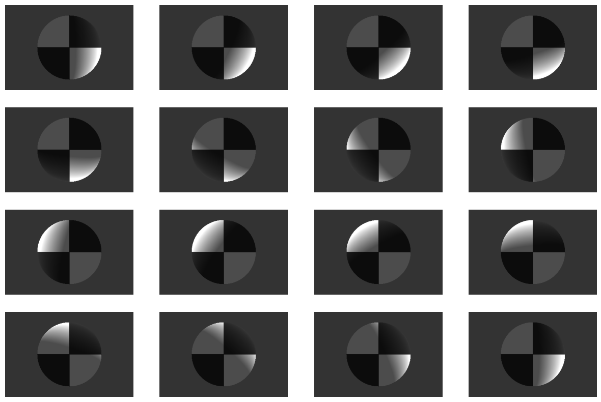
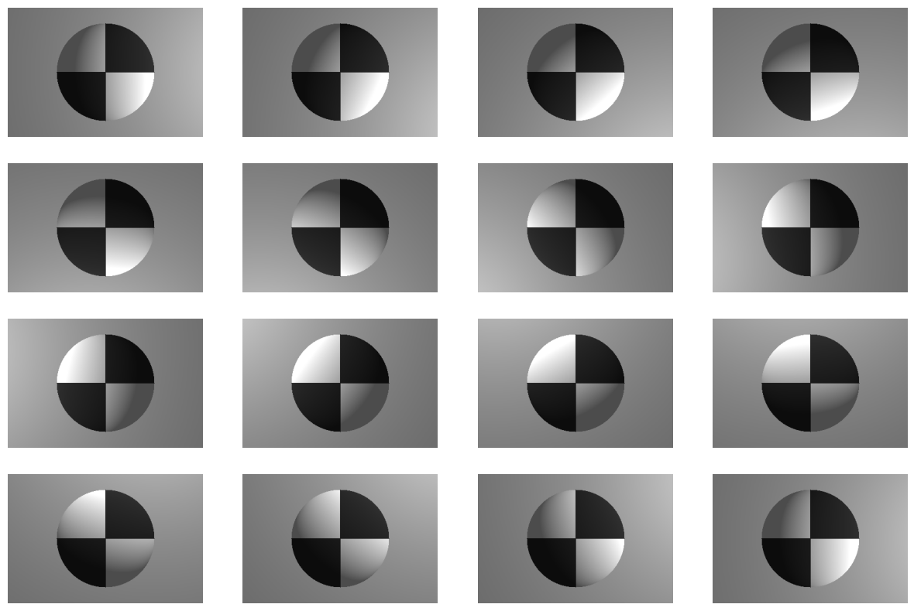
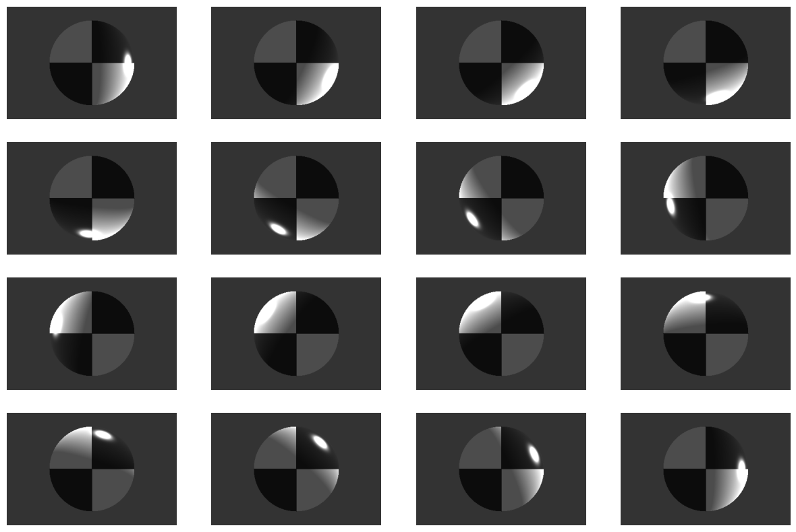
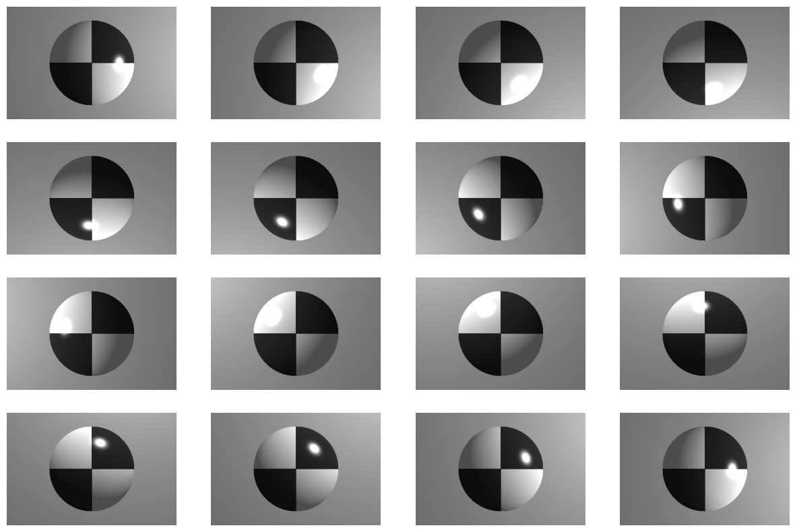
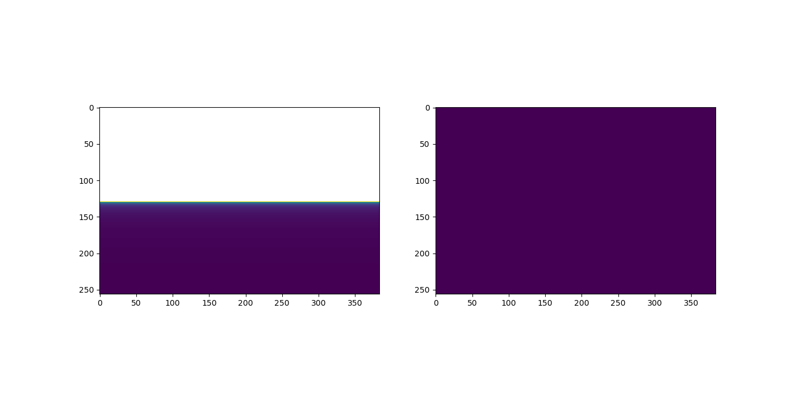

# MP1-Q3 by Jongwon Lee (jongwon5)

## Preliminary
- The following code has been tested in Python 3.7.9, with packages of `numpy=1.19.1` and `matplotlib=3.3.1`.
- All implementations and results can be found in the directory [q3_code/](q3_code/).
- All conventions, especially the direction of vectors in Phong Shading Model, ahere to that in Szeliski. For better clarification, I attach the image from TA, which apparently shows the relationship between the direction of incident light ($\hat{v}_{i}$) and reflected light ($\hat{s}_{i}$), which is parameterized by the normal of the surface ($\hat{n}$). In addition, the viewing direction is depicted as well ($\hat{v}_{r}$). Note that all directional vectors should be normalized before any operation.
<div align="center">

</div>

## How to run
- To recreate the results, you may simply execute the [render_image.py](render_image.py). It will automatically generates four distinct images with different light condition.

## Results
1. No specular reflection and point light source. Just a directional light source that moves around the object (`specular0_move_direction.png`)

<div align="center">

</div>

2. No specular reflection and directional light. Just a point light source that moves around the object (`specular0_move_point.png`)

<div align="center">

</div>

3. No point light source, but a directional light source that moves around the object with specular reflection (`specular1_move_direction.png`)

<div align="center">

</div>

4. No directional light, but a point light source that moves around the object with specular reflection (`specular1_move_point.png`)

<div align="center">

</div>

For the case 1 and 3, a directional light starting from the positive part of x-axis and rotating clockwise around z-axis was projected to the source. (Namely, `directional_light_dirn = [np.cos(theta), np.sin(theta), .1]`, where `theta` ranges from 0 to 2$\pi$.)

As similar to this, for the case 2 and 4, a point light source starting from the positive part of x-axis and rotating clockwise around z-axis was assumed to be located behind the center of camera coordinate. (Hence, `point_light_loc = [10*np.cos(theta), 10*np.sin(theta), -3]`, where `theta` ranges from 0 to 2$\pi$.)

While `theta` changes from 0 to 2$\pi$, the subfigures are plotted column-wise followed by row-wise. Hence, each scenarios are drawn in the order of
```
 1  2  3  4
 5  6  7  8
 9 10 11 12
13 14 15 16
```
while `theta` increases. 

Considering that the point light source in the case 2 and 4 is located behind than the directional light source in the case 1 and 3, you may see that the specular reflection in 4 occurs at more frontal part of the sphere than that of 3. Overall, we can conclude that the implementation of Phong's model has been properly done.

## How does it work?
The key issue in implementing Phong's model is how to take into account three different directional vectors. In this code, all the directional convention obeys Fig.2.15. in Szeliski. 

Here, I attach the code that fills in the array of incident light ($\hat{v}_{i}$), reflected light ($\hat{s}_{i}$), and ($\hat{v}_{r}$), which depend on the object's 3D location that we are looking at in the camera coordinate $(X, Y, depth)$ as well as the normal of the surface ($\hat{n}$), each of which corresponds to the 2d pixel's coordinate $(u, v)$ in the image frame we are looking into. 

```
for v in range(h):
  for u in range(w):
    depth = Z[v, u]           # depth to the object from camera center
    X = depth / f * (u - cx)  # X coordinate of the object w.r.t. the camera center
    Y = depth / f * (v - cy)  # Y coordinate of the object w.r.t. the camera center
    
    # incident light direction
    vi_p[v, u, :] = - np.array([X - point_light_loc[0][0], Y - point_light_loc[0][1], depth - point_light_loc[0][2]])
    vi_d[v, u, :] = np.array(directional_light_dirn[0])
    # specular reflection direction (see Section 2.2., Equation 2.90. in Szeliski)
    si_p[v, u, :] = np.matmul(2 * N[v, u, :] * N[v, u, :][:, np.newaxis] - np.eye(3), vi_p[v, u, :])
    si_d[v, u, :] = np.matmul(2 * N[v, u, :] * N[v, u, :][:, np.newaxis] - np.eye(3), vi_d[v, u, :])
    # viewing direction
    vr[v, u, :] = - np.array([X, Y, depth])
```

At first, each 2D pixel coordinate $(u, v)$ should be converted into the 3D camera coordinate $(X, Y, depth)$, which is parametrized by the focal length ($f$) and camera center $(c_{x}, c_{y})$ as well. After than, incident light vector ($\hat{v}_{i}$) for every pixel can be estimated as all pixels' location in 3D camera coordinate has been decided in the prior step. Note that the incident light's direction for both the point light source ($\left(\hat{v}_{i}\right)_{p}$) and the directional light ($\left(\hat{v}_{i}\right)_{d}$) needs to be calculated respectively as both of them are in our consideration. Regarding that $\left(\hat{v}_{i}\right)_{p}$ is defined as *the direction from the incidental surface to the light source*, a minus sign has been appended for *the direction from the light source to the incidental surface*. Once both $\left(\hat{v}_{i}\right)_{p}$ and $\left(\hat{v}_{i}\right)_{d}$ has been calculated, we can estimate reflective light vector ($\hat{s}_{i}$). Since $\hat{s}_{i}$ depends on $\hat{v}_{i}$, $\hat{s}_{i}$ for $\left(\hat{v}_{i}\right)_{p}$ and $\left(\hat{v}_{i}\right)_{d}$ should be calculated respectively as well. Using the Equation 2.90. in Szeliski ($\hat{s}_{i} = \left(2\hat{n}\hat{n}^{T} - I_{3\times3}\right)\hat{v}_{i}$), the reflective direction for both point light source ($\left(\hat{s}_{i}\right)_{p}$) and directional light ($\left(\hat{s}_{i}\right)_{d}$) are obtained. Lastly, the viewing direction ($\hat{v}_{r}$), *the direction from the reflected surface to the observer*, are estimated.

Keep in mind that all of these directional vectors should be normalized not to occur any problem while we sum up all light intensity terms in Phong's model. If not, it may cause the overflow and the outcome image will be saturated.

Once all directional vectors are prepared, the only thing to do is just to calculate each intensity term and add them up to generate the resulting image. I attach the code of this part below - Note that any dot product between two identical size of 2D arrays composed with 3D vectors are implemented with `einsum` function in `numpy` package because `dot` function exclusively supports the doc product between two 3D vectors. Also, `clip` function was applied to the outcome to exclude any non-negative parts.

```
# Ambient Term
Ia = A * ambient_light

# Diffuse Term
point_light_strength = point_light_strength[0]
directional_light_strength = directional_light_strength[0]

Id_p = A * point_light_strength * np.clip(np.einsum('ijk,ijk->ij', vi_p, N), 0, None)
Id_d = A * directional_light_strength * np.clip(np.einsum('ijk,ijk->ij', vi_d, N), 0, None)

# Specular Term
Is_p = S * point_light_strength * pow(np.clip(np.einsum('ijk,ijk->ij', vr, si_p), 0, None), k_e)
Is_d = S * directional_light_strength * pow(np.clip(np.einsum('ijk,ijk->ij', vr, si_d), 0, None), k_e)

# Sum up terms above
I = Ia + Id_p + Id_d + Is_p + Is_d
```

For more detail, it is highly recommended to navigate into [render_image.py](render_image.py).

<div style="page-break-after: always;"></div>

# MP1-Q4 by Jongwon Lee (jongwon5)

## Preliminary
- The following code has been tested in Python 3.7.9, with packages of `numpy=1.19.1` and `matplotlib=3.3.1`.
- All implementations and results can be found in the directory [q4_code/](q4_code/).
- For the derivation of the relationship between the camera's velocity and any object's location w.r.t. 3D camera coordinate, please refer to my response in Question 4.1. One of the most annoying concept is how we can convert any physical quantity taken in fixed frame to a .rotating frame. For more reference on this, please refer to the following paper:
> Zhao, Shiyu. "Time derivative of rotation matrices: A tutorial." arXiv preprint arXiv:1609.06088 (2016).

## How to run
- To recreate the results, you may simply execute [dynamic_perspective_starter.py](dynamic_perspective_starter.py). It will automatically generates five PDF files in different camera motion scenarios.

## Implementation
All tasks are listed below:
1. Looking forward on a horizontal plane while driving on a flat road.
2. Sitting in a train and looking out over a flat field from a side window.
3. Flying into a wall head-on.
4. Flying into a wall but also translating horizontally, and vertically.
5. Counter-clockwise rotating in front of a wall about the Y-axis.

The outcome of two functions `get_road_z_image` and `get_wall_z_image` in [dynamic_perspective_starter.py](dynamic_perspective_starter.py) are shown below. For simplicity, the outcome of `get_road_z_image` is called as `road` from now on whereas that of `get_wall_z_image` as `wall`.

<div align="center">

</div>


Hence, we can rewrite the tasks in more intuitive notation as:

1. `road`, $v_{z} = 1$
2. `road`, $v_{x} = 1$
3. `wall`, $v_{z} = 1$
4. `wall`, $\vec{v} = \left(v_{x}, v_{y}, v_{z}\right) = (1, 1, 1)$
5. `wall`, $\omega_{y} > 1$

These five scenarios are executed and plotted in each corresponding PDF file, respectively.

The biggest challenge for the implementation is how to generate corresponding optical flows in an image frame w.r.t. the simulated camera motion. To handle this, the response in Queston 4.1. has been carefully implementation in the function `create_optical_flow` in [dynamic_perspective_starter.py](dynamic_perspective_starter.py). Here, I attach the key algorithm to obtain optical flow:

```
for v in range(szy):
  for u in range(szx):
    depth = Z[v, u]           # depth of the object w.r.t. camera center
    X = depth / f * (u - cx)  # X coordinate of the object w.r.t. the camera center in 3D
    Y = depth / f * (v - cy)  # Y coordinate of the object w.r.t. the camera center in 3D
    
    x = f * X / depth   # x coordinate of pixel w.r.t. the camera center in 2D
    y = f * Y / depth   # y coordinate of pixel w.r.t. the camera center in 2D

    # Construct matrices for translational and rotational velocity
    T = np.array([[-f, 0, x], 
                  [0, -f, y]])
    R = np.array([[x*y, -(x**2+f**2),  y],
                  [(y**2+f**2), -x*y, -x]])
    
    # Compute optical flow
    # eps has been added to avoid zero division
    of = T @ t / (depth + eps) + R @ w / f
    of_x[v, u] = of[0]
    of_y[v, u] = of[1]
```

At first, any 2D pixel coordinate $(u, v)$ should be properly transformed into a corresponding 3D camera coordinate $(X, Y, depth)$. Note that $(x, y)$ is represented in 2D pixel coordinate, whose center is collocated to the camera center (i.e. same as the origin of $(X, Y, depth)$. Once the coordinate conversion has been done, we can construct two different matrices $T$ and $R$ which impose the weight for $\hat{v}$ and $\hat{\omega}$ while calculating the optical flow. After than, we can estimate the optical flow along x and y axes, respectively.

## Results

Please refer to the attached appendices. The outcomes align with our intuition.
1. `road`, $v_{z} = 1$
- As the camera is moving into the image, the optical flow is coming toward the camera.
2. `road`, $v_{x} = 1$
- As the camera is moving right, the optical flow heads toward left, which is the opposite direction of the movement.
3. `wall`, $v_{z} = 1$
- As the camera is moving into the image, the optical flow is coming toward the camera.
4. `wall`, $\vec{v} = \left(v_{x}, v_{y}, v_{z}\right) = (1, 1, 1)$
- As the camera is moving into the image's bottom-right side, we perceive the optical flow originated from bottom-right as well as coming toward the camera.
5. `wall`, $\omega_{y} > 1$
- Since the camera is counterclockwise around y-axis, which towards downward, we perceive the optical flow heading toward left.