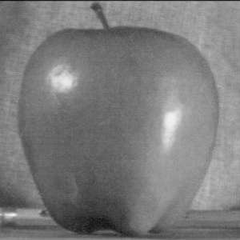
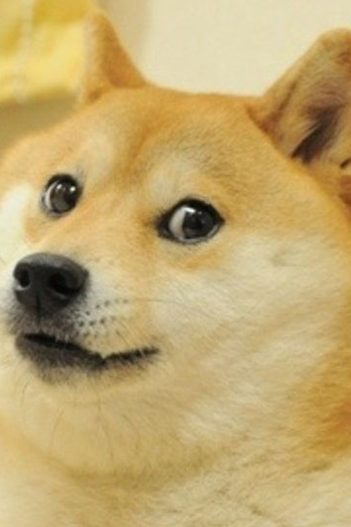
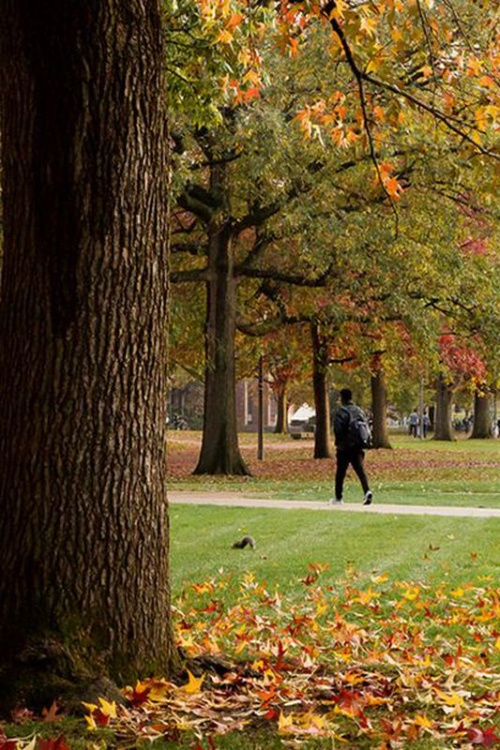

## Multi-resolution Blending

1. **Method Description.**

- The suggested pyramid blending algorithm is developed as follows:

    ```
    def blend(im1, im2, mask):
    """
    description : blend images by pyramid blending
    param im1 : input image 1
    param im2 : input image 2
    param mask : mask for image blending (ones for im1, whereas zeros for im2)
    output out : blended image output
    """

    mask = mask / 255.
    
    gp_im1 = construct_gp(im1)
    gp_im2 = construct_gp(im2)
    gp_mask = construct_gp(mask)

    lp_im1 = construct_lp(gp_im1)
    lp_im2 = construct_lp(gp_im2)
    
    out = combine_lp(gp_mask, lp_im1, lp_im2)
    
    return out
    ```

    To be specific, corresponding gaussian pyramids for both the input images and mask are constructed by `construct_gp` at first. After then, laplacian pyramids (i.e. pyramids of difference of gaussian) of the computed gaussian pyramid for `im1` and `im2` are obtained through `construct_lp`. Lastly, the output image is obtained by executing `combine_lp`, a function that merges DoGs of two inputs (`lp_im1`, `lp_im2`) with weighing `gp_mask`.

- `construct_gp`: A function that constructs gaussian pyramid, a set of downsampled images with proper smoothing. Note that the return value is a `list` type variable with a length of `octave+1`, starting from the original input image in the order of descreased (and smoothed over and over) downsamples.
    
    ```
    def construct_gp(im, sig=1., octave=5):
    """
    description : construct a gaussian pyramid with corresponding smoothness and octaves
    param im : input image
    param sig : standard deviation of gaussian filter to be used
    param octave : number of images to comprise the pyramid
    output gp : list of gaussian pyramid, a set of smoothed images, with smoothing and downsampling.
                (note: first element is original image, and others are sequence of downsamples)
    """
    G = im.copy()
    gp = [G]
    
    for i in range(octave):
        G = scipy.ndimage.gaussian_filter(gp[i], sig, order=0, output=None, mode='reflect')
        G = cv2.resize(G, (G.shape[1]//2, G.shape[0]//2))
        gp.append(G)

    return gp
    ```

- `construct_lp`: A function that constructs laplacian pyramid, a set of difference of gaussians (DoGs) from the input gaussian pyramid. Note that the return value is a `list` type variable with a length of `octave+1`, where the first element is the smallest gaussian (i.e. not DoG) followed by DoGs in the order of upsamples. The reason why the smallest gaussian is appended as the first element is to provide a 'baseline' while adding up all DoGs in different scales in `combine_lp`.
    
    ```
    def construct_lp(gp, octave=5):
    """
    description : construct a laplacian pyramid from corresponding gaussian pyramid
    param gp : a gaussian pyramid in concern
    param octave : number of images comprising the pyramid
    output lp : list of laplacian pyramid, a set of difference of gaussian (DoG)
                (note: downsamples in lp is in the order of smallest to largest, which is inverse to gp)
    """

    assert len(gp) == octave+1

    lp = [gp[-1]]
    
    for i in range(octave, 0, -1):
        G_upsampled = cv2.resize(gp[i], (gp[i-1].shape[1], gp[i-1].shape[0]))
        L = cv2.subtract(gp[i-1], G_upsampled)
        lp.append(L)
    
    return lp
    ```

- `combine_lp`: A function that adds up all images in laplacian pyramids from smallest to largest with corresponding gaussian pyramid of the mask. It constructs a list of blended DoGs (`lp_bend`) from two input laplacian pyramids weighed by `gp_mask`, in the order of smallest to largest. After then, it calculates the output image by adding up all blended DoGs from a baseline (`lp_blend[0] = gp_mask[-1]`), by upsampling intermediate results.

    ```
    def combine_lp(gp_mask, lp_im1, lp_im2, octave=5):
    """
    description : add up all images in laplacian pyramids with mask
    param gp_mask : gaussian pyramid of mask
    param lp_im1 : laplacian pyramid of input image 1
    param lp_im2 : laplacian pyramid of input image 2
    param octave : number of images comprising pyramids
    output out : blended image output
    """

    assert octave+1 == len(gp_mask) == len(lp_im1) == len(lp_im2)

    lp_blend = [gp_mask[-1]]
    for i in range(octave+1):
        lp_blend.append(gp_mask[octave-i] * lp_im1[i] + (1. - gp_mask[octave-i]) * lp_im2[i])
    
    out = lp_blend[0]
    for i in range(octave+1):
        out = cv2.resize(out, (lp_blend[i+1].shape[1], lp_blend[i+1].shape[0]))
        out = cv2.add(out, lp_blend[i+1])

    return out
    ```


2. **Oraple.**

    Below shows the outcome of introduced pyramid blending algorithm. It merges the first image [oraple/apple.jpeg](oraple/apple.jpeg) and the second image [oraple/orange.jpeg](oraple/orange.jpeg) with a mask [oraple/mask.png](oraple/mask.png), whose nonzero pixels weighs for the first and zeros for the second. The rightmost image represents the outcome, and you can see that the blending has been done smoothly without any drastic change near the boundary of [oraple/mask.png](oraple/mask.png).

    <div align="center">
        
        
        
        
    </div>

3. **Blends of your choice.** 

    Below shows the additional result of introduced pyramid blending algorithm on my choice. It merges the first image [dog/dog.jpeg](dog/dog.jpeg) and the second image [dog/campus.jpeg](dog/campus.jpeg) with a mask [dog/mask.png](dog/mask.png), whose nonzero pixels weighs for the first and zeros for the second. The rightmost image represents the outcome, and you can see that the blending has been done smoothly without any drastic change near the boundary of [dog/mask.png](dog/mask.png).

    <div align="center">
        
        
        
        
    </div>

    The most remarkable point is that it successfully weighs non-zero pixels in the mask between 0 and 1, whereas [oraple/mask.png](oraple/mask.png) in the previous section contains only 0 or 1. Since [dog/mask.png](dog/mask.png) includes values ranging from 0 to 1, th result [dog/result.png](dog/result.png) is more smoother than [oraple/oraple.png](oraple/oraple.png), in which more sharper mask has been used.