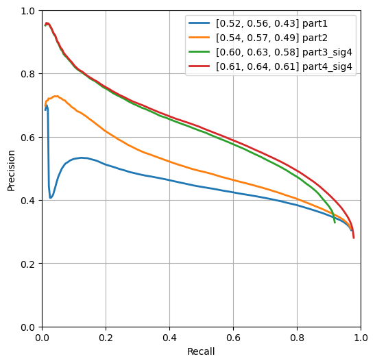
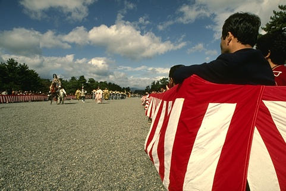
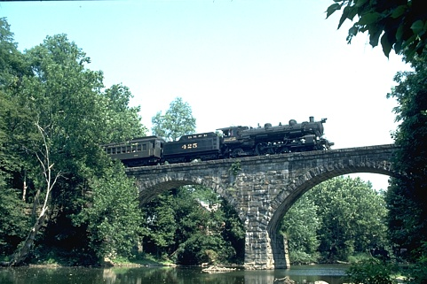

## Contour Detection

1. **Method Description.** 

- Let's start with detecting contour for the following image:

<div align="center">
   
</div>

- **part 1 (vanilla)**: A method that detects edges along both x and y directions by using a generic derivative. This can be implemented by following filter:

   ```
   dx = signal.convolve2d(I, np.array([[-1, 0, 1]]), mode='same')
   dy = signal.convolve2d(I, np.array([[-1, 0, 1]]).T, mode='same')
   ```
   
   However, as can be seen in the following image, it demonstrates unwanted artifact at its edges. The left is the calculated edge for `14037.png`, and the right is its cropped image around the leftmost corner.

   <div align="center">
      
      
   </div>

   This is definitely due to the fact that the current `convolve2d` filter passes a default argument `fill` for a padding parameter `boundary`, which fills boundary pixels with pre-defined value and executes the convolution. This may result in unwanted outcome as depicted above.
   
- **part 2 (modified `convolve2d` filter)**: To handle this issue, we should pass a proper argument for the padding parameter `boundary`. This artifact can be lessen by putting `symm` as a argument for `boundary`, which filles image boundaries with symmetric values around each edge. 

   ```
   dx = signal.convolve2d(I, np.array([[-1, 0, 1]]), mode='same', boundary='symm')
   dy = signal.convolve2d(I, np.array([[-1, 0, 1]]).T, mode='same', boundary='symm')
   ```

   As a result, we are able to obtain more desirable outcome as follows:

   <div align="center">
      
      
   </div>

   Comparing the outcome from `part1` and `part2`, we are able to compare the difference more clearly:
   
   <div align="center">
      
      
   </div>
   
- **part 3 (smoothing)**: So far, we obtain image edges by simply calculating the corresponding image's gradient. This is susceptible from the image noise or may easily degraded in the region were image pixel values drastically change. To prevent these problems, smoothing with a gaussian filter can be utilized:

   ```
   dx = ndimage.gaussian_filter1d(I,   sigma=1., order=1)
   dy = ndimage.gaussian_filter1d(I.T, sigma=1., order=1).T
   ```

   Note that `sigma` is a parameter that decides the filter's size. The larger `sigma`, the more smoothing effect we have. `order`, an optional but crucial parameter corresponds to convolution with that derivative of a Gaussian. Hence, we were supposed to obtain the convolution with generic gaussian filter by default (`order=0`). However, as can be seen above, we are able to obtain the difference of gaussian (DoG) by specifying `sigma` as 1. This results in an image contour applied with gaussian smoothing. Below shows results obtained by varing `sigma` from one to five, respectively.

   <div align="center">
      
      
      
      
      
   </div>

   With small `sigma`, there exists a clear advantage that we can detect more details. However, it also implies a drawback that the outcome is easily affected by image noise. With large `sigma`, however, the outcome become more robust to noise whereas the opportunity to overlook fine edges highly increases. From the benchmark comparison in **chapter 3**, I concluded that a gaussian filter with `sigma=4` shows the best performance overall. Therefore, any result from now on will be assumed to be the result obtained with `sigma=4` without any specific comment.

   That being said, however, the outcome with DoG is not exactly the result we desired as it is saturated with non-max contours extensively:
   
   <div align="center">
      
   </div>

- **part 4 (non-max suppression)**: To implement non-max suppression, any calculated contour pixels should be compared with pixels projected along two directions: in which the gradient increases and decreases, respecitively. Since there might not exist pixels along these directions, the imaginary pixel value for these neighborhood should be constructed by interpolating other adjacent pixels. Overall, the procedure can be divided intot two steps: (1) constructing the coordinate of these imaginary pixels along gradient's direction and its opposite and (2) calculating edge scores at these pixels by interpolating adjacent pixels.

   ```
   given: mag, direction (both are size of (h, w))
   for all pixel at (h, w):
      angle = direction(h, w)
      angle = rad2deg(angle)

      if 0 <= angle < 45:
         p = interpolate(mag[h, w+1], mag[h+1, w+1])
         r = interpolate(mag[h-1, w-1], mag[h, w-1])
      else if 45 <= angle < 90:
         p = interpolate(mag[h+1, w], mag[h+1, w+1])
         r = interpolate(mag[h-1, w-1], mag[h-1, w])
      else if 90 <= angle < 135:
         p = interpolate(mag[h+1, w-1], mag[h+1, w])
         r = interpolate(mag[h-1, w], mag[h-1, w+1])
      else if 135 <= angle < 180:
         p = interpolate(mag[h, w-1], mag[h+1, w-1])
         r = interpolate(mag[h-1, w+1], mag[h, w+1])
      else if 180 <= angle < 225:
         p = interpolate(mag[h-1, w-1], mag[h, w-1])
         r = interpolate(mag[h, w+1], mag[h+1, w+1])
      if 225 <= angle < 270:
         p = interpolate(mag[h-1, w-1], mag[h-1, w])
         r = interpolate(mag[h+1, w], mag[h+1, w+1])
      if 270 <= angle < 315:
         p = interpolate(mag[h-1, w], mag[h-1, w+1])
         r = interpolate(mag[h+1, w-1], mag[h+1, w])
      if 315 <= angle < 360:
         p = interpolate(mag[h-1, w+1], mag[h, w+1])
         r = interpolate(mag[h, w-1], mag[h+1, w-1])

      if mag[h, w] == max(mag[h, w], p, r):
          pass
      else:
         mag[h, w] = 0
   ``` 

   The interpolation has been done with simple form of linear interpolation. For more details, it is highly recommended to have a look in `contour_solve.py`. 
   
   As a result, the following contour image has been achieved. Note that non-max regions have been mostly rejected compared with that of **part 3**:

   <div align="center">
      
   </div>


2. **Precision Recall Plot.**

   Below compares precision-recall curves for the suggested methods for contour detection from **part 1** to **part 4**. Note that the results for **part 3** and **part 4** were obtained by gaussian filter with `sigma=4`.

   <div align="center">
      
   </div>

   Note that there has been a significant improvement between **part 2** and **part 3**. It implies that smoothing the image before calculating an image's gradient plays an important role in enhancing the overall quantitative performance. Also, observing that the performance in **part 2** is superior to **part 1** especially in low-recall region, it is observed that just removing the boundary artifacts by replacing the padding parameter from `fill` to `symm` in differential filter is quite effective. Lastly, comparing **part 3** and **part 4**, it can be concluded that non-max suppression shows improvement in high-recall region in the provided benchmark.
   

3. **Results Table.**

   Below compares quantitative results for the suggested methods for contour detection from **part 1** to **part 4**. Note that the gaussian filter size from `sigma=1` to `sigma=5` were compared in **part 3**, whereas only the outcome of `sigma=4`, which demonstrated the best result in **part 3**, was presented in **part 4**.

   | method | remark | overall max F-score | average max F-score | AP | runtime (seconds) |
   | ----------- | --- | --- | ---  | --- |  --- |
   | Initial implementation || 0.518496 | 0.556084 | 0.426090 | 0.011404 |
   | Warm-up [remove boundary artifacts] || 0.538742 | 0.574959 | 0.491509 | 0.017467 |
   |  | $\sigma = 1$ | 0.554528 | 0.582049 | 0.523452 | 0.005019 |
   |  | $\sigma = 2$ | 0.582706 | 0.592016 | 0.555228 | 0.005906 |
   | Smoothing | $\sigma = 3$ | 0.579611 | 0.606990 | 0.547489 | 0.007028 |
   |  | $\sigma = 4$ | 0.603072 | 0.629803 | 0.580837 | 0.008024 |
   |  | $\sigma = 5$ | 0.599326 | 0.627457 | 0.576806 | 0.009129 |
   | Non-max suppression | $\sigma = 4$ | 0.614312 | 0.638384 | 0.613139 | 3.400985 |
   | Test set numbers of best model [From gradescope] || |  |  |  |

4. **Visualizations.**
   
   Here, three different qualitative results obtained with suggested method (DoG with `sigma=4` followed by bidirectional non-max suppression) were shown below:

   <div align="center">
      
      
   </div>

   <div align="center">
      
      
   </div>

   <div align="center">
      
      
   </div>

   Though the suggested algorithm is quite effective for detecting coarse contours, it can be observed that it shows slightly unwanted results in the region where fine edges or detailed patterns exist. This is attributed to the fact that non-max suppresion was done pixelwise; it simply suppresses non-maxima by investigating their most adjacent neighborhoods. Therefore, in order to avoid detecting these fine patterns, an additional method that compares each pixel with more larger scale (i.e. in a patch) should be applied.

5. **Bells and Whistles.** *TODO*: Include details of the bells and whistles that you
   tried here.

   *TODO*: Present the performance metrics for the bells and whistles in a table format
   
   | Method | overall max F-score | average max F-score | AP | Runtime (seconds) |
   | ----------- | --- | --- | ---  | --- |
   | Best base Implementation (from above) | | | | 
   | Bells and whistle (1) [extra credit]) | | | | 
   | Bells and whistle (2) [extra credit]) | | | |
   | Bells and whistle (n) [extra credit]) | | | |