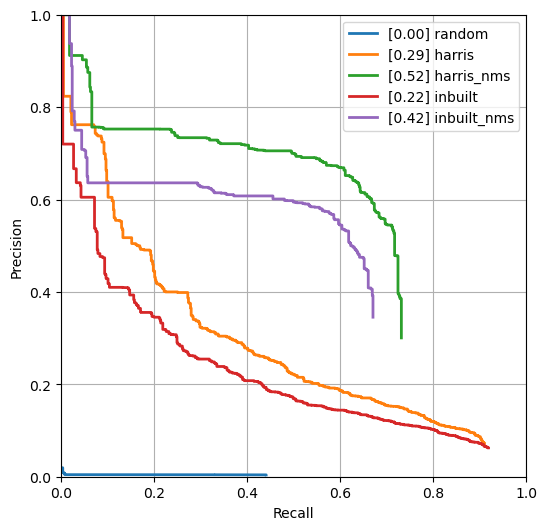

## Corner Detection

1. **Method Description.** 

   The developed `compute_corners` receives three different hyperparameters and returns two `np.array` type data, response and corners. The detailed explanation is below. Note that I did not specify the size and extent of gaussian blurring as it operates with a window size `window_size` ($ws$), which is same to the generic searching window size of this corner detector, and with a automatically determined standard deviation `(window_size//2) / 3`, which is known as a maximum size to avoid aliasing.
   
   ```
   Input:
      I : input image, H w W w 3 BGR image
      window_size : window size for operation
      ws_nonmax : window size for nonmax suppression
      alpha : hyperparameter for R = det(M) - alpha * tr(M) ** 2
   Output:
      response : H w W response map in uint8 format
      corners : H w W map in uint8 format _after_ non-max suppression. Each
      pixel stores the score for being a corner. Non-max suppressed pixels
   ```

   From now on, I would like to introduce its working principle step-by-step. For further details, you may refer to [corner_solve.py](corner_solve.py).

   The algorithm is divided into three big parts: (1) calculating gradient, (2) constructing `response`, and (3) constructing `corners` by non-max supression. 
   
   (1) Calculating gradient: It is a essential step preparing for constructing `response` for all pixels. The most important thing to be done in this step is calculate the image gradient along both horizontal (`dx`) and vertical direction (`dy`) and declare `Ixx`, `Ixy`, and `Iyy`, the elementwise multiplication of (`dx`, `dx`), (`dx`, `dy`), and (`dy`, `dy`), respectively.

   ```
   I = cv2.cvtColor(I, cv2.COLOR_BGR2GRAY)
   H = I.shape[0]
   W = I.shape[1]

   # Declare variables to be returned
   response = np.zeros(I.shape)
   corners  = np.zeros(I.shape)

   # Create image gradient
   dx = signal.convolve2d(I, np.array([[-1, 0, 1]]), mode='same', boundary='symm')
   dy = signal.convolve2d(I, np.array([[-1, 0, 1]]).T, mode='same', boundary='symm')
   Ixx = dx**2
   Ixy = dx*dy
   Iyy = dy**2
   ```

   (2) Constructing `response`: Now we construct the corner response function, $R = det(M) - \alpha \cdot {tr(M)}^{2}$, for every pixel where $M$ is a 2x2 square matrix whose elements are sum of neighborhood elements of size (`window_size`, `window_size`) for `Ixx`, `Ixy`, and `Iyy`, around the pixel in concern (`window_Ixx`, `window_Ixy`, `window_Iyy`). Note that a window following a 2D gaussian distribution (`w_gaussian`), whose standard deviation is determined as one third of the half of its window size, is weighted while constructing `window_Ixx`, `window_Ixy`, and `window_Iyy` for each pixel. After then, the resulting `response` is clipped to avoid any edge or flat region. 

   ```
   # Generate guassian filter with the size of `window_size`, whose standard deviation is one third of `window_size // 2`
   w_gaussian = create_gaussian_kernel(window_size, (window_size // 2) / 3)
   
   # Find corner response over all pixels
   offset = window_size // 2
   for h in range(offset, H-offset):
      for w in range(offset, W-offset):
         window_Ixx = Ixx[h-offset:h+offset+1, w-offset:w+offset+1]
         window_Ixy = Ixy[h-offset:h+offset+1, w-offset:w+offset+1]
         window_Iyy = Iyy[h-offset:h+offset+1, w-offset:w+offset+1]
         
         window_Ixx = w_gaussian * window_Ixx
         window_Ixy = w_gaussian * window_Ixy
         window_Iyy = w_gaussian * window_Iyy
         
         sum_xx = window_Ixx.sum()
         sum_xy = window_Ixy.sum()
         sum_yy = window_Iyy.sum()

         M = np.array([[sum_xx, sum_xy],
                     [sum_xy, sum_yy]])
         
         R = np.linalg.det(M) - alpha * (np.trace(M) ** 2)
         response[h,w] = R

   # Clip the response to avoid edge or flat region
   _, response = cv2.threshold(response, 0.001*response.max(), np.inf, cv2.THRESH_TOZERO)
   response = (response - response.min()) / (response.max() - response.min()) * 255.
   response = response.astype(np.uint8)
   ```

   The detailed implementation on `create_gaussian_kernel`, a function generating a window follows 2D gaussian distribution, is shown below. This has an effect of approximating higher-order gradient as well as blurring the noisy output:

   ```
   def create_gaussian_kernel(window_size, sigma):
   """
   Create 2D gaussian kernel with the size of `window_size` and standard deviation of `sigma`
   Input:
      window_size : kernel size to be created
      sigma : standard deviation of gaussian kernel
   Output:
      kernel : a 2D gaussian kernel which has a standard deviation of `sigma` and the squared size of `window_size`
   """
   ax = np.linspace(-(window_size-1)/2, (window_size-1)/2, window_size)
   xx, yy = np.meshgrid(ax, ax)
   kernel = np.exp(-0.5 * (np.square(xx) + np.square(yy)) / np.square(sigma))
   return kernel
   ```

   For instance, the visualized output of `create_gaussian_kernel(window_size=9, sigma=(9//2)/3)` is as follows:

   <div align="center">
      
   </div>

   (3) Constructing `corners` by non-max supression: Unlike `response` is a raw H x W response map in uint8 format, `corners` return a *non-max supressed* H x W response map in uint8 format. Regarding the window size of non-max supression is given as `ws_nonmax` ($ws_{nms}$), computing `corners` can be easily done as follows:

   ```
   # Do non-max suppression with a window size of `ws_nonmax`
   offset = ws_nonmax // 2
   for h in range(offset, H-offset):
      for w in range(offset, W-offset):
         window = response[h-offset:h+offset+1, w-offset:w+offset+1]
         corners[h,w] = response[h,w] if window.max() == response[h,w] else 0
   ```

2. **Precision Recall Plot.**

   The figure below demonstrates the comparison of precision-recall curve (PR curve) for (1) the vanilla version given as it was (i.e. dump random results), (2) suggested harris corner detection with $(ws=5, \alpha=0.06)$, and (3) the same operation followed by non-max supression with ${ws}_{nms}=7$. For baseline, I also compare the results from (4) the in-built Harris corner detection (`cv2.cornerHarris(src, blockSize=wsize, ksize=wsize, k=alpha)`) with $(ws=3, \alpha=0.06)$ and (5) the same operation followed by non-max supression with ${ws}_{nms}=5$.

   <div align="center">
      
   </div>

   As can be seen above, the suggest method exceeds the performance of in-built Harris Corner Detector, though it may vary from dataset to dataset or hyperparameter to hyperparameter. In addition to this, it can be concluded that the non-max suppression plays an important role in improving the overall performance in the given benchmark. 

3. **Results Table.** 

   Below shows average precision scores (AP score) for all suggested corner detection method with a set of hyperparameters. 
   
   From experiment 2 to 4, I tried to investigate the performance w.r.t. $\ws$ while fixing $\alpha$ as 0.06 and concluded that $\ws=5$ presented the most dominant outcome. In a similar way, the performance w.r.t. different $\alpha$ was investigated from experiment 5 to 7 and the conclusion has been drawn that $\alpha=0.06$ performs best among these.

   From experiment 8 to 11, the effect of applying non-max supression as a postprocessing step has been investigated. While carrying out these experiments, $ws$ and $\alpha$ were fixed as 5 and 0.06 respectively, the values which has turned out to be the best from experiment 2 to 7. As a result, we can observe that a non-max supression with a window size 7 ($ws_{nms}=7$) showed the best outcome in the given benchmark.

   | Index |     Method       |     remarks               |    AP    | Runtime  |
   | ----- | ---------------- | ------------------------- | -------- | -------- |
   |   1   | Random (vanilla) |                           | 0.001973 | 0.001942 |
   |   2   | Harris w/o NMS   | $ws=3, \alpha=0.06$       | 0.092704 | 1.010528 |
   |   3   | Harris w/o NMS   | $ws=5, \alpha=0.06$       | **0.286048** | 0.966164 |
   |   4   | Harris w/o NMS   | $ws=7, \alpha=0.06$       | 0.209214 | 1.088427 |
   |   5   | Harris w/o NMS   | $ws=5, \alpha=0.04$       | 0.263894 | 1.013282 |
   |   6   | Harris w/o NMS   | $ws=5, \alpha=0.05$       | 0.272789 | 1.109275 |
   |   7   | Harris w/o NMS   | $ws=5, \alpha=0.06$       | **0.286048** | 0.966164 |
   |   8   | Harris w/ NMS    | $ws_{nms}=3$              | 0.518228 | 1.106011 |
   |   9   | Harris w/ NMS    | $ws_{nms}=5$              | 0.520726 | 1.038278 |
   |   10  | Harris w/ NMS    | $ws_{nms}=7$              | **0.524210** | 0.954629 |
   |   11  | Harris w/ NMS    | $ws_{nms}=9$              | 0.497800 | 1.032269 |
   |   12  | Test set numbers of best model [From gradescope] | same as exp. 10. | **0.52421** | **0.53** |


4. **Visualizations.** 

   Here, the qualitative results for the implemented Harris Corner Detector are presented. As we concluded in the previous section, the set of hyperparameters which demonstrated the best performance overall (i.e. $ws=5$, $\alpha=0.06$, $ws_{nms}=7$) was used.

   <div align="center">
      
   </div>

   <div align="center">
      
   </div>

   <div align="center">
      
   </div>

   For a pair comparison, results done by in-built Harris Corner Detector (`cv2.cornerHarris(src, blockSize=wsize, ksize=wsize, k=alpha)`) with $ws=3$, $\alpha=0.06$, and ${ws}_{nms}=5$ for the same images were provided as well.

   <div align="center">
      
   </div>

   <div align="center">
      
   </div>

   <div align="center">
      
   </div>
   
   From these outcomes, it can be concluded that the developed corner detection algorithm from scratch shows almost the comparable results with that of ``cv2.cornerHarris`, though it seems like to fail in detecting corners (e.g. lower-right corner of the cube in the first image) or detect non-corners (e.g. cracks on the ground in the second image). These artifact can be lessen by fine-tuning the set of hyperparameters or more elaborated methods, such as multiscale dection, or etc.

5. **Bells and Whistles.** 

- In this section, I tried to improve the corner detection performance beyond that of Harris' original version. Most of the ideas are inspired by:

   > Bellavia, F., D. Tegolo, and Cf Valenti. "Improving Harris corner selection strategy." IET Computer Vision 5.2 (2011): 87-96.

- The most significant technique exploited here is all determinants and traces for each small window $M$, which is an essential component to be constructed while computing the corner response for each pixel, are zero-mean normalized. It has two significant theoretical advantages compared with the original one. First, the corner response is likely to be stable and invariant globally regardless of what the illunation or texture is as it is normalized from that of flat region, which is dominant in the image. Second, it allows us not to struggle with fine-tuning $\alpha$, a hyperparameter governing the response function's behavior.

   The second idea is the image gradient is weighed by binary mask, which has zeros for pixels below the average magnitude of gradient whereas ones for above it. By doing so, all candidates for non-significant gradient region can be effectively rejected.

- Now, let's look into it more details with code blocks. First, the gradient along two axes and their masked results are computed:

   ```
   I = cv2.cvtColor(I, cv2.COLOR_BGR2GRAY)
   H = I.shape[0]
   W = I.shape[1]

   # Declare variables to be returned
   response = np.zeros(I.shape)
   corners  = np.zeros(I.shape)

   # Create image gradient
   dx = signal.convolve2d(I, np.array([[-1, 0, 1]]), mode='same', boundary='symm')
   dy = signal.convolve2d(I, np.array([[-1, 0, 1]]).T, mode='same', boundary='symm')
   Ixx = dx**2
   Ixy = dx*dy
   Iyy = dy**2

   # Enhance gradients
   G = np.sqrt(Ixx + Iyy)
   mask = np.where(G < G.mean(), 0., 1.)

   Ixx = mask * Ixx
   Iyy = mask * Iyy
   ```

   Then, `M_dets` and `M_traces` are constructed over all pixels around a window with  square size of `window_size`. This is an preprocessing step for zero-mean normalization of corresponding determinant and trace for each window:

   ```
   # Generate guassian filter with the size of `window_size`, whose standard deviation is one third of `window_size // 2`
   w_gaussian = create_gaussian_kernel(window_size, (window_size // 2) / 3)

   # Find array of patchs over all pixels
   offset = window_size // 2
   M_dets = np.full(I.shape, np.nan)
   M_traces = np.full(I.shape, np.nan)
   for h in range(offset, H-offset):
      for w in range(offset, W-offset):
         window_Ixx = Ixx[h-offset:h+offset+1, w-offset:w+offset+1]
         window_Ixy = Ixy[h-offset:h+offset+1, w-offset:w+offset+1]
         window_Iyy = Iyy[h-offset:h+offset+1, w-offset:w+offset+1]
         
         window_Ixx = w_gaussian * window_Ixx
         window_Ixy = w_gaussian * window_Ixy
         window_Iyy = w_gaussian * window_Iyy
         
         sum_xx = window_Ixx.sum()
         sum_xy = window_Ixy.sum()
         sum_yy = window_Iyy.sum()

         patch = np.array([[sum_xx, sum_xy],
                           [sum_xy, sum_yy]])
         M_dets[h, w] = np.linalg.det(patch)
         M_traces[h, w] = np.trace(patch)
   ```

   After then, responses for all pixels are computed. Note that all determinants and traces are normalized and a hyperparameter `alpha` is no longer used in the definition of response function:

   ```
   # Compute mean and stdv over all data
   mu_det = np.nanmean(M_dets)
   std_det = np.nanstd(M_dets)
   mu_tr = np.nanmean(M_traces)
   std_tr = np.nanstd(M_traces)

   # Construct response with zero-mean normalization
   for h in range(offset, H-offset):
      for w in range(offset, W-offset):
         response[h,w] = (M_dets[h,w] - mu_det) / std_det - (M_traces[h,w] - mu_tr) / std_tr 
   ``` 

   The postprocessing steps, clipping and non-max suppression, are identical to the original version. 

- Though this extension makes perfect sense to me theoretically and is supposed to perform better in general cases, the actual results presented on the provided benchmark does not seems like to be superior to the original one. Note that the result with non-max suprresion does not show any supremacy compared with the original version.

   | Method | Average Precision | Runtime |
   | ------ | ----------------- | ------- |
   | Harris w/ NMS ($ws=5, \alpha=0.06, ws_{nms}=7$) |  **0.524210** | 0.954629 |
   | zero-meaned Harris w/ NMS ($ws=3, ws_{nms}=7$)  | 0.403649 | 1.047272 |
   | zero-meaned Harris w/ NMS ($ws=5, ws_{nms}=7$)  | 0.359373 | 0.934424 |
   | zero-meaned Harris w/ NMS ($ws=7, ws_{nms}=7$)  | 0.309713 | 1.079308 |

- That being said, however, we cannot readily deduce that the suggested method in a totally wrong direction as there exist a number of factors not taken into account. For instance, the performance may vary from the dataset on which we evaluate. Otherwise, its optimal hyperparameter might have way different values that I did not investigate. Certainly, it can be a challenging but intriguing topic to be studied.

