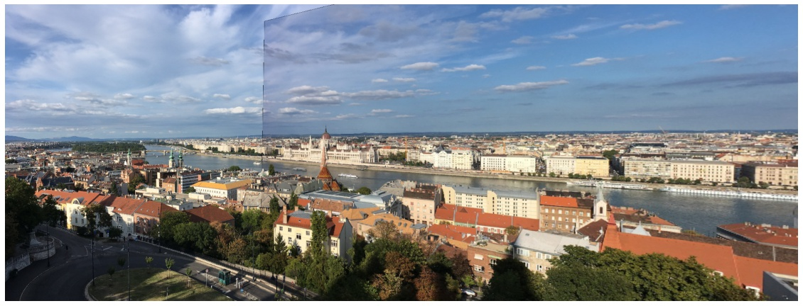
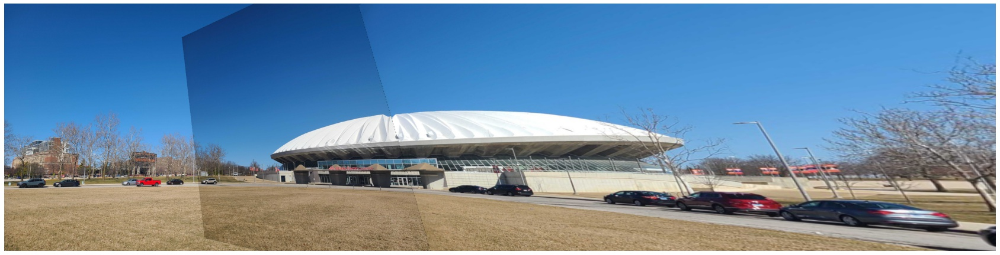

## MP3-Q1 by Jongwon Lee (jongwon5)

## **Putative Matches [5 pts].** 

### Implementation

Top-k Putative matches based on the matrix of pairwise descriptor distances can be readily implemented by the vritue of functions supported in python libraries including `cv2.get_sift_data`  and `scipy.spatial.distance.cdist`. The only thing we need to specify is the number of descriptor matches to find, named `num_matches`. As a result, the function `get_best_matches` returns top-k correponding matched feature results in img1 and img2:

```
def get_best_matches(img1, img2, num_matches=300):
    """
    Descriptions: find putative matches for descriptors in two images
    Inputs:
        img1: first image to investigate
        img2: second image to investigate
        num_matches: number of best matches to find
    Returns:
        pt_pairs: np.ndarray with shape (num_matches, 4)
            where the `num_matches` best matches are listed in an sorted order.
            the first two columns are for pixel coordinates in img1, and the others are corresponding for img2 correspondingly.
    """
    # Get SIFT keypoints and the corresponding descriptors
    kp1, des1 = get_sift_data(img1)
    kp2, des2 = get_sift_data(img2)
    kp1, kp2 = np.array(kp1), np.array(kp2)
    
    # Find distance between descriptors in the two images
    dist = scipy.spatial.distance.cdist(des1, des2, 'sqeuclidean')
    
    # From `dist`, find `num_matches` smallest sorted indices
    # `indices` has the size of (num_matches, 2) where each row is (row, col) for `dist`
    indices_raw = dist.ravel().argsort()[:num_matches]
    indices = np.stack(np.unravel_index(indices_raw, dist.shape)).T

    # Find corresponding pixel location in `kp1` and `kp2`
    pt_pairs = np.empty((num_matches, 4))
    for i, idx in enumerate(indices):
        pt_pairs[i, 0:2] = kp1[idx[0]].pt
        pt_pairs[i, 2:4] = kp2[idx[1]].pt

    return pt_pairs
```

### Result

The efficacy of the function `get_best_matches` can be observed by running the following command. In this case, it may visualize the case where the number of matches are 300:

```
data = get_best_matches(img1, img2, 300)
fig, ax = plt.subplots(figsize=(20,10))
plot_inlier_matches(ax, img1, img2, data)
fig.savefig('sift_match.jpg', bbox_inches='tight')
```

The outcome of executing `get_best_matches` is shown below. Note that some wrong matches appears though most of the descriptors are paired correctly.

<div align="center">

</div>


## **Homography Estimation and RANSAC [20 pts].** 

### Implementation

A function `ransac` exploits the RANSAC algorithm to estimate a homography mapping one image onto the other. In order to assist its implementation, two different sub-functions `_compute_reproj_error` and `_compute_homography` are developed as well.

First, details on `ransac` is shown below. Note that two hyperparameters can be desginated for a successful RANSAC result, `num_iteration` and `threshold`. Another type of parameters which might have been inluded---such as the number of sample points, proportion of outliers, or etc--- are fixed and not taken into consideration.

```
def ransac(pt_pairs, num_iteration=100, threshold=1):
    """
    Descriptions: find homography estimation between two images using RANSAC
    Inputs:
        pt_pairs: np.ndarray with shape (N, 4)
            where the first two columns stand for pixel coordinates for descriptors in img1, and others in img2 correspondinly
        num_iteration: number of iteration for RANSAC (in slide, a variable denoted as `N`)
        threshold: distance threshold for choosing inliers. (in slide, a variable denoted as `\delta`)
    Remark: number of samples (in slide, a variable denoted as `N`) is fixed to be 4 in this implementation
    Returns:
        H: np.ndarray with shape (3, 3)
            where the homography from img1 to img2
        inliers_best: np.ndarray with shape (N_inliers, 4)
            where inliers for `pt_pairs` corresponding to `H`
        inlier_residuals: np.ndarray with shape (N_inliers, )
            where the residuals for `inliers_best`
    """

    ### phase 1. for every iteration...
    # variable to save inliers with the largest population
    inliers_best = np.empty((0,4))
    
    for n in range(num_iteration):
        # choose four points randomly
        candidates = pt_pairs[np.random.choice(pt_pairs.shape[0], 4)]

        # construct a homography candidate
        H = _compute_homography(candidates)
        inliers = np.empty((0,4))

        # estimate inliers for the homography candidate
        for k in range(len(pt_pairs)):
            d = _compute_reproj_error(pt_pairs[k], H)
            if d < threshold:
                inliers = np.append(inliers, pt_pairs[k][np.newaxis], axis=0)
        
        # count inliers and update `inliers_best` if their number exceeds the former
        if len(inliers) > len(inliers_best):
            inliers_best = inliers
    
    ### phase 2. after all iterations are done...
    # refine H
    H = _compute_homography(inliers_best)

    # update corresponding inliers again and construct model errors
    inliers_best = np.empty((0,4))
    inlier_residuals = np.empty((0,))
    for k in range(len(pt_pairs)):
        d = _compute_reproj_error(pt_pairs[k], H)
        if d < threshold:threshold
            inliers_best = np.append(inliers_best, pt_pairs[k][np.newaxis], axis=0)
            inlier_residuals = np.append(inlier_residuals, d)

    return H, inliers_best, inlier_residuals
```

Below shows two utility functions `_compute_reproj_error` and `_compute_homography` to facilitate the `ransac` function. As expected from their names, `_compute_reproj_error` computes the reprojection error (in pixel) for a given keypoint pair and `_compute_homography` estimates the homography from given pixel correspondences.

```
def _compute_reproj_error(pt_pair, H):
    """
    Descriptions: compute reprojection error of a given point pair for the given homography H
    Inputs:
        pt_pairs: np.ndarray with shape (4, )
            where the first two entries stand for pixel coordinates for descriptors in img1, and others in img2 correspondinly
        H: np.ndarray with shape (3, 3)
            where the homography from img1 to img2
    Returns:
        np.linalg.norm(error): residual from the original point w.r.t. the other projected by H
    """
    # construct homogeneous coordinates for the point pair in two images
    x0 = np.append(pt_pair[:2], 1)
    x1 = np.append(pt_pair[2:], 1)
    
    # project x0 onto the image of X1 by the given homography H
    x1_proj = np.dot(H, x0)
    x1_proj /= x1_proj[-1]

    # compute the reprojection error
    error = x1 - x1_proj
    return np.linalg.norm(error)
```

```
def _compute_homography(pt_pairs):
    """
      param pt_pairs : (N, 4) shape np.array whose rows are of (pt1, pt2) correspondingly
      return H : (3, 3) shape np.array for estimated matrix
    """
    assert len(pt_pairs) >= 4

    # construct matrix equation Ap = 0 to solve the homography
    A = np.empty((0, 9))
    for pt in pt_pairs:
        x0 = np.append(pt[:2], 1)
        x1 = np.append(pt[2:], 1)
        A = np.append(A, np.concatenate([np.zeros(3), x0, -x1[1] * x0])[np.newaxis], axis=0)
        A = np.append(A, np.concatenate([x0, np.zeros(3), -x1[0] * x0])[np.newaxis], axis=0)
    
    #svd composition
    U, S, V = np.linalg.svd(A)

    #reshape the min singular value into a 3 by 3 matrix
    H = np.reshape(V[-1, :], (3, 3))

    #normalize and now we have H
    H /= H[-1, -1]
    return H
```
### Result

`ransac`'s outcome can be obtained by executing the following. Please keep in mind that both the average model error and inlier ratio for the estimated homography are monitored. Though we do not know which pair of hyperparameters---`num_iteration`, `threshold`----works best, I investigated the performances by varying these quantities:

```
from numpy import arange

for num_iters in range(10, 60, 10):
    for thres in arange(0.5, 2.5, 0.5):
        H, inliers, inlier_residuals = ransac(data, num_iteration=num_iters, threshold=thres)
        residual = np.average(inlier_residuals)
        ratio = len(inliers) / len(data)
        print(f"[# of iteration: {num_iters}, thres: {thres:.1f}] residual: {residual:.2f}, ratio: {ratio:.2f}")
```

```
[# of iteration: 10, thres: 0.5] residual: 0.26, ratio: 0.25
[# of iteration: 10, thres: 1.0] residual: 0.49, ratio: 0.63
[# of iteration: 10, thres: 1.5] residual: 0.61, ratio: 0.81
[# of iteration: 10, thres: 2.0] residual: 0.66, ratio: 0.89
[# of iteration: 20, thres: 0.5] residual: 0.25, ratio: 0.39
[# of iteration: 20, thres: 1.0] residual: 0.49, ratio: 0.63
[# of iteration: 20, thres: 1.5] residual: 0.58, ratio: 0.82
[# of iteration: 20, thres: 2.0] residual: 0.69, ratio: 0.90
[# of iteration: 30, thres: 0.5] residual: 0.28, ratio: 0.34
[# of iteration: 30, thres: 1.0] residual: 0.41, ratio: 0.63
[# of iteration: 30, thres: 1.5] residual: 0.59, ratio: 0.82
[# of iteration: 30, thres: 2.0] residual: 0.65, ratio: 0.89
[# of iteration: 40, thres: 0.5] residual: 0.28, ratio: 0.36
[# of iteration: 40, thres: 1.0] residual: 0.51, ratio: 0.70
[# of iteration: 40, thres: 1.5] residual: 0.60, ratio: 0.84
[# of iteration: 40, thres: 2.0] residual: 0.67, ratio: 0.89
[# of iteration: 50, thres: 0.5] residual: 0.26, ratio: 0.29
[# of iteration: 50, thres: 1.0] residual: 0.48, ratio: 0.68
[# of iteration: 50, thres: 1.5] residual: 0.62, ratio: 0.85
[# of iteration: 50, thres: 2.0] residual: 0.67, ratio: 0.90
```

- For sure, the smaller residual is more desirable, and it can be achieved by decreasing the threshold. That being said, we face a trade-off that a small residual typically implies small inlier ratio, which is to be avoided. In this respect, it seems like that threshold for 1.0 reconciles this issue as it shows acceptable values for both residual error (about 0.5) and inlier ratio (about 0.6).
- Increasing the number of iteration ensures to find a general and optimal model without returning a wrong (but seems to be correct in few candidates) one. Therefore, except for the increasing computation time, the large number of iteration is always a rule of thumb to obtain a consistent result.

Regarding these observation, I have decided to use 1 for `threshold` and 20 for `num_iteration`. Below shows code and the corresponding result:

```
# display the inlier matching, report the average residual
H, inliers, inlier_residuals = ransac(data, num_iteration=50, threshold=1)
print(f"Average residual: {np.average(inlier_residuals):.2f}")
print(f"Inlier ratio: {len(inliers) / len(data):.2f}")

fig, ax = plt.subplots(figsize=(20,10))
plot_inlier_matches(ax, img1, img2, inliers)
fig.savefig('ransac_match.jpg', bbox_inches='tight')
```


The outcome of executing above is shown below. Note that the aforementioned wrong matches (i.e. outlier matches) are succesfully excluded by the virtue of RANSAC.

```
Average residual: 0.47
Inlier ratio: 0.66
```

<div align="center">

</div>


## **Image Warping [5 pts].**

### Implementation

`warp_images` warp one image onto the other using the estimated homography H and show the merged result. The details are given below:

```
def warp_images(ax, img1, img2, H):
    """
    Descriptions: warp img2 onto img1 and by inverse of the given homography H and plot them together
    Inputs:
        ax: pyplot axis
        img1: the first image
        img2: the second image (to be warped onto the plane of img1)
        H: homography from img1 to img2
    """

    # compute the inverse of H, the homography from img2 to img1
    H_inv = np.linalg.inv(H)

    # temporary canvas for merging img1 and img2
    img1_tmp = np.hstack([img1, np.zeros(img1.shape, dtype=np.uint8)])
    img2_tmp = cv2.warpPerspective(img2, H_inv, (2*img1.shape[1], img1.shape[0]))

    # create masks for occupied pixels in `img1_tmp` and `img2_tmp`
    img1_mask = cv2.cvtColor(img1_tmp, cv2.COLOR_BGR2GRAY)
    img2_mask = cv2.cvtColor(img2_tmp, cv2.COLOR_BGR2GRAY)

    _, img1_mask = cv2.threshold(img1_mask, 0, 255, cv2.THRESH_BINARY)
    _, img2_mask = cv2.threshold(img2_mask, 0, 255, cv2.THRESH_BINARY)
    img2_mask_inv = cv2.bitwise_not(img2_mask)

    # leave pixels exclusively active in either img1_tmp or img2_tmp
    img1_roi = cv2.bitwise_and(img1_tmp, img1_tmp, mask=img2_mask_inv)
    img2_roi = cv2.bitwise_and(img2_tmp, img2_tmp, mask=img2_mask)

    # merge img1_roi and img2_roi then plot the result
    res = cv2.addWeighted(img1_roi, 1., img2_roi, 1., 0)

    ax.set_aspect('equal')
    ax.imshow(res, cmap='gray')
    ax.axis('off')
```

### Results

It can be seen that we are capable of obtaining an consistent and reasonable stitched image based on the estimated homography by running `warp_images`.

```
fig, ax = plt.subplots(figsize=(20,10))
warp_images(ax, img1, img2, H)

# display and report the stitching results
fig.savefig('stitched_images.jpg', bbox_inches='tight')
```

<div align="center">

</div>


## **Extra Credit [5 pts].**

For extra credits, I extended my homography estimation onto multiple images, as provided in [Q1/extra_credits](Q1/extra_credits).

### Implementation

- As image size has been increased, hyperparamters for RANSAC algorithm should be adjusted. To be specific, the number of the iteration (`num_iteration`) and the threshold for reprojection error (`thres`) had to be tuned to be 100 and 10, respectively. Empirically, these values led to achieve reasonable inlier ratio and their average residual.
- In the function `warp_images`, the second image (`img2`) is warped onto the canvas of the first (`img1`) and stitched by the inverse of given homography (`H`). However, if the images are stitched from left to right sequentailly for the task of stitching three images, this result in a significant problem that the rightmost image become diminished. To avoid this issue, I stitched the center (`img2`) and the right (`img3`) at first then merged the resulting image (`tmp`) onto the left (`img1`) so that a reasonable outcome can be obtained.


```
### extra credit

opt_num = 3 # choose among 1, 2, and 3
opt_dict = {1: 'opt_01/park', 2: 'opt_02/state_farm', 3: 'opt_03/hessel'}

img1 = imread(f'./extra_credits/{opt_dict[opt_num]}_left.jpg')
img2 = imread(f'./extra_credits/{opt_dict[opt_num]}_center.jpg')
img3 = imread(f'./extra_credits/{opt_dict[opt_num]}_right.jpg')

# matches between img1 and img2
matches_left = get_best_matches(img1, img2, 300)
H_left, inliers_left, inlier_residuals_left = ransac(matches_left, num_iteration=100, threshold=10)
print(f"Average residual: {np.average(inlier_residuals_left):.2f}")
print(f"Inlier ratio: {len(inliers_left) / len(matches_left):.2f}")

# matches between img2 and img3
matches_right = get_best_matches(img2, img3, 300)
H_right, inliers_right, inlier_residuals_right = ransac(matches_right, num_iteration=100, threshold=10)
print(f"Average residual: {np.average(inlier_residuals_right):.2f}")
print(f"Inlier ratio: {len(inliers_right) / len(matches_right):.2f}")

# stitch img2 and img3 first, then merge it with img1
fig, ax = plt.subplots(figsize=(30,10))
tmp = warp_images(ax, img2, img3, H_right)
res = warp_images(ax, img1, tmp, H_left)
fig.savefig(f'./extra_credits/{opt_dict[opt_num]}_stitched.jpg', bbox_inches='tight')
```

### Results

It can be seen that we are capable of obtaining an consistent and reasonable stitched image based on the estimated homography.

<div align="center">



</div>