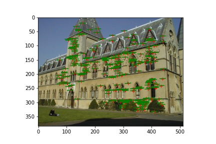
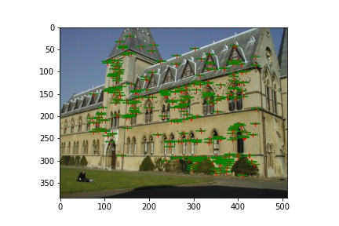
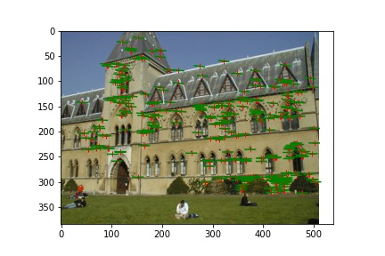

## MP3-Q2 by Jongwon Lee (jongwon5)

## **Fundamental Matrix Estimation [10 pts][^2].**

### Implementation

Eight-point algorithm for estimating fundamental matrix in both unnormalized and normalized way are implemented as below. Note that the rank-2 constraint has been imposed by forcing the smallest singular value to be zero, reconstructing the original matrix, and repeating the singular value decomposition again. For normalized algorithm, remark that the resulting fundamental matrix in a **normalized** coordinate should be recovered into the **original** world.

```
# write your code here for part estimating essential matrices
def fit_fundamental(p1, p2):
    """
    Desciption: Solves for the fundamental matrix using the matches with unnormalized method.
    Params: 
        p1 (Nx2): 2d points on frame 1
        p2 (Nx2): 2d points on frame 2
    Returns:
        F_rank2: fundamental matrix where rank-2 constraint has been imposed
    """
    assert len(p1) == len(p2) >= 8
    
    A = np.empty((len(p1), 9))
    for i in range(len(p1)):
        u, v = p1[i]
        ud, vd = p2[i]

        A[i] = [ud * u, ud * v, ud, vd * u, vd * v, vd, u, v, 1]
    
    #svd composition
    U, S, V = np.linalg.svd(A)

    #reshape the min singular value into a 3 by 3 matrix
    F = np.reshape(V[-1, :], (3, 3))

    #enforce rank-2
    U, S, V = np.linalg.svd(F)
    S[-1] = 0
    F_rank2 = U @ np.diag(S) @ V

    return F_rank2


def fit_fundamental_normalized(p1, p2):
    """
    Desciption: Solves for the fundamental matrix using the matches with normalized method.
    Params: 
        p1 (Nx2): 2d points on frame 1
        p2 (Nx2): 2d points on frame 2
    Returns:
        F_rank2: fundamental matrix where rank-2 constraint has been imposed
    """
    assert len(p1) == len(p2) >= 8
    
    # normalize p1
    p1_normalized = (p1 - p1.mean(axis=0)) / p1.std(axis=0)
    T = np.eye(3)
    T[:2, -1] -= p1.mean(axis=0)
    T[:2, :] /= p1.std(axis=0)[:, np.newaxis]

    # normalize p2
    p2_normalized = (p2 - p2.mean(axis=0)) / p2.std(axis=0)
    Td = np.eye(3)
    Td[:2, -1] -= p2.mean(axis=0)
    Td[:2, :] /= p2.std(axis=0)[:, np.newaxis]

    # construct least square problem
    A = np.empty((len(p1_normalized), 9))
    for i in range(len(p1_normalized)):
        u, v = p1_normalized[i]
        ud, vd = p2_normalized[i]

        A[i] = [ud * u, ud * v, ud, vd * u, vd * v, vd, u, v, 1]
    
    #svd composition
    U, S, V = np.linalg.svd(A)

    #reshape the min singular value into a 3 by 3 matrix
    F_normalized = np.reshape(V[-1, :], (3, 3))

    #enforce rank-2
    U, S, V = np.linalg.svd(F_normalized)
    S[-1] = 0
    F_normalized_rank2 = U @ np.diag(S) @ V

    # return to the original units
    F_rank2 = Td.T @ F_normalized_rank2 @ T

    return F_rank2
```

### Results

To show the effectiveness of the aformentioned implementation, the below command was executed.

```
# non-normalized method
pt1_2d = matches[:, :2]
pt2_2d = matches[:, 2:]

F = fit_fundamental(pt1_2d, pt2_2d) # <YOUR CODE>

v2 = get_residual(F, pt1_2d, pt2_2d)
v1 = get_residual(F.T, pt2_2d, pt1_2d)
print('{:s}: residual in frame 2 (non-normalized method) = '.format(name), v2)
print('{:s}: residual in frame 1 (non-normalized method) = '.format(name), v1)
print('{:s}: residual combined   (non-normalized method) = '.format(name), (v1+v2)/2)
# Plot epipolar lines in image I2
fig, ax = plt.subplots()
plot_fundamental(ax, F, pt1_2d, pt2_2d, I2)
plt.savefig('./{:s}1_unnormalized.jpg'.format(name))
# Plot epipolar lines in image I1
fig, ax = plt.subplots()
plot_fundamental(ax, F.T, pt2_2d, pt1_2d, I1)
plt.savefig('./{:s}2_unnormalized.jpg'.format(name))

# normalized method
pt1_2d = matches[:, :2]
pt2_2d = matches[:, 2:]

F = fit_fundamental_normalized(pt1_2d, pt2_2d) # <YOUR CODE>
v2 = get_residual(F, pt1_2d, pt2_2d)
v1 = get_residual(F.T, pt2_2d, pt1_2d)
print('{:s}: residual in frame 2 (normalized method) = '.format(name), v2)
print('{:s}: residual in frame 1 (normalized method) = '.format(name), v1)
print('{:s}: residual combined   (normalized method) = '.format(name), (v1+v2)/2)
# Plot epipolar lines in image I2
fig, ax = plt.subplots()
plot_fundamental(ax, F, pt1_2d, pt2_2d, I2)
# Plot epipolar lines in image I1
fig, ax = plt.subplots()
plot_fundamental(ax, F.T, pt2_2d, pt1_2d, I1)
```

By running above, the outcomes for both unnormalized and normalized eight-point algorithms are visualized as well as quantitative errors. As expected, normalized case demonstrates slightly improved performance.

```
library: residual in frame 2 (non-normalized method) =  0.17921336680315691
library: residual in frame 1 (non-normalized method) =  0.14912309938770843
library: residual combined   (non-normalized method) =  0.16416823309543266
```

<div align="center">
  
  
</div>


```
library: residual in frame 2 (normalized method) =  0.06033445847957677
library: residual in frame 1 (normalized method) =  0.05484509861965621
library: residual combined   (normalized method) =  0.057589778549616485
```

<div align="center">
  
  
</div>


## **Camera Calibration [10 pts].**

### Implementation

Estimating camera projection matrix for a given set of 2d-3d feature correspondences is developed in the functon `camera_calibration`. Note that at least six correspondences are required to ensure the existence of the solution for $Ap = 0$, where $p$ is a flattened form with length 12 of the 3 X 4 camera projection matrix.

```
def camera_calibration(points_2d, points_3d):
    """
    Descriptions: compute camera matrix
    Parameters:
        points_2d: np.ndarray with shape (N, 3), where each row stands for a 2d homogeneous coordinate in the image frame
        points_3d: np.ndarray with shape (N, 4), where each row stands for a corresponding 3d homogeneous coordinate in the world frame
    """
    assert len(points_2d) == len(points_3d) >= 6
    
    # construct Ap = 0
    A = np.empty((2 * len(points_2d), 12))
    for i in range(len(points_2d)):
        x, y = points_2d[i]
        pt_3d = np.append(points_3d[i], 1)
        A[2*i] = np.concatenate([np.zeros(4), pt_3d, -y * pt_3d], axis=0)
        A[2*i+1] = np.concatenate([pt_3d, np.zeros(4), -x * pt_3d], axis=0)
    
    # svd composition
    U, S, V = np.linalg.svd(A)

    # reshape the min singular value into a 3 by 4 matrix
    P = np.reshape(V[-1, :], (3, 4))
    
    return P
```

### Results

To investigate whether `camera_calibration` is working properly, the following commands are executed. It loads a set of 3D points (in world frame) as well as corresponding features in two different point of views (in camera frame), estimates and shows the residuals in the two cases.

```
# Load 3D points, and their corresponding locations in 
# the two images.
pts_3d = np.loadtxt('./lab_3d.txt')
matches = np.loadtxt('./lab_matches.txt')
pt1_2d = matches[:, :2]
pt2_2d = matches[:, 2:]

# <YOUR CODE> print lab camera projection matrices:
lab1_proj = camera_calibration(pt1_2d, pts_3d)
lab2_proj = camera_calibration(pt2_2d, pts_3d)
print('lab 1 camera projection')
print(lab1_proj)

print('')
print('lab 2 camera projection')
print(lab2_proj)

# <YOUR CODE> evaluate the residuals for both estimated cameras
_, lab1_res = evaluate_points(lab1_proj, pt1_2d, pts_3d)
print('residuals between the observed 2D points and the projected 3D points:')
print('residual in lab1:', lab1_res)
_, lab2_res = evaluate_points(lab2_proj, pt2_2d, pts_3d)
print('residual in lab2:', lab2_res)
```

As can be seen in below, the residuals for two different 2d feature set, `pt1_2d` and `pt2_2d`, w.r.t. that in 3d world coordinate, `pts_3d`, are less then 20. This is an expected outcome which fulfills the requirement provided by the instruction.

```
lab 1 camera projection
[[-3.09963996e-03 -1.46204548e-04  4.48497465e-04  9.78930678e-01]
 [-3.07018252e-04 -6.37193664e-04  2.77356178e-03  2.04144405e-01]
 [-1.67933533e-06 -2.74767684e-06  6.83964827e-07  1.32882928e-03]]

lab 2 camera projection
[[ 6.93154686e-03 -4.01684470e-03 -1.32602928e-03 -8.26700554e-01]
 [ 1.54768732e-03  1.02452760e-03 -7.27440714e-03 -5.62523256e-01]
 [ 7.60946050e-06  3.70953989e-06 -1.90203244e-06 -3.38807712e-03]]
residuals between the observed 2D points and the projected 3D points:
residual in lab1: 13.545832894770703
residual in lab2: 15.544953451653466
```

## **Camera Centers [5 pts].** 

### Implementation

A camera center in 3d world coordinate can be estimated by investigating an non-trivial null space for a given 3 X 4 camera projection matrix. Follow is about how to achieve this:

```
# Write your code here for computing camera centers
def calc_camera_center(M):
    """
    Descriptions: get camera center in the world from the projection matrix
    Parameters:
        M: np.ndarray with shape (3, 4), a camera projection matrix
    Returns:
        camera_center: np.ndarray with shape (3, ), the estimated camera center corresponding to M
    """
    from scipy.linalg import null_space
    
    camera_center = null_space(M)   # estimate the camera center, a vector in the null space of M
    camera_center /= camera_center[-1]  # normalize camera_center to be 3d homogeneous coordinate
    camera_center = np.squeeze(camera_center[:-1])  # convert camera_center in homogeneous coordinate to be in non-homogeneous coordinate
    
    return camera_center
```

### Results

As we already have four different projection matrices---lab1_proj, lab2_proj, lib1_proj, and lib2_proj---the corresponding camera centers can be calculated.

```
# <YOUR CODE> compute the camera centers using 
# the projection matrices
lab1_c = calc_camera_center(lab1_proj)
lab2_c = calc_camera_center(lab2_proj)
print('lab1 camera center', lab1_c)
print('lab2 camera center', lab2_c)

# <YOUR CODE> compute the camera centers with the projection matrices
lib1_c = calc_camera_center(lib1_proj)
lib2_c = calc_camera_center(lib2_proj)
print('library1 camera center', lib1_c)
print('library2 camera center', lib2_c)
```

The outcomes are shown below. Note that both two pairs--(`lab1_c`, `lab2_c`), (`lib1_c`, `lib2_c`)--are slightly different as they were taken in different locations.

```
lab1 camera center [305.83276769 304.20103826  30.13699243]
lab2 camera center [303.10003925 307.18428016  30.42166874]
library1 camera center [  7.28863053 -21.52118112  17.73503585]
library2 camera center [  6.89405488 -15.39232716  23.41498687]
```

## **Triangulation [10 pts].** 

### Implementation

Triangulation, an algorithm estimating a specific 3D point given a set of pixel coordinates seen from different point of views (i.e. w.r.t. different camera projection matrices), can be achieved by formulating a linear least-square problem. As each 2D-3D relationship generates two independent equations, only two pairs are sufficient to solve the problem. The key concept is identical to what we have investigated so far; just stack a set of equations, establish a least-square problem ($Ap = 0$), and solve it by DLT. For more details, please refer to the following [slides](http://www.cs.cmu.edu/~16385/s17/Slides/11.4_Triangulation.pdf).

```
def triangulation(pts1_2d, pts2_2d, M1, M2):
    """
    Description: triangulate the points in 3D given their 2D correspondences (pts1_2d, pts2_2d) and projection matrices (M1, M2)
        please refer to the equations in the following slides for more details: http://www.cs.cmu.edu/~16385/s17/Slides/11.4_Triangulation.pdf
    Params:
        pts1_2d: np.ndarray with shape (N, 2), features in 2D homogeneous coordinate from the first FOV
        pts3_2d: np.ndarray with shape (N, 2), features in 2D homogeneous coordinate from the second FOV
        M1: np.ndarray with shape (3, 4), a projection matrix corresponding to the first FOV
        M2: np.ndarray with shape (3, 4), a projection matrix corresponding to the second FOV
    Returns:
        pts_3d: np.ndarray with shape (N, 3), features reconstructed from two different FOVs expressed in 3D coordinate
    """
    assert len(pts1_2d) == len(pts2_2d)
    N = len(pts1_2d)

    pts_3d = np.empty((N, 3))

    for i in range(N):
        x1, y1 = pts1_2d[i]
        x2, y2 = pts2_2d[i]
        
        A = np.vstack((y1 * M1[2,:] -      M1[1,:],
                            M1[0,:] - x1 * M1[2,:],
                       y2 * M2[2,:] -      M2[1,:],
                            M2[0,:] - x2 * M2[2,:]))

        # svd composition
        U, S, V = np.linalg.svd(A)

        # reshape the min singular value into a 3d homogeneous coordinate
        pt_3d = np.reshape(V[-1, :], (4,))
        
        # normalize it
        pt_3d /= pt_3d[-1]

        # convert 3d homogeneous representation to be non-homogeneous one
        pts_3d[i] = pt_3d[:-1]
    return pts_3d
```

### Results

Below shows the quantitative performances obtained by projecting the reconstructed 3D points onto the corresponding 2D frames. Though the overall error is quite large unlike I expected, it has been reported in this class's piazza website that these are the outcomes supposed to be obtained.

```
Mean 3D reconstuction error for the lab data:  0.01332
2D reprojection error for the lab 1 data:  10.899446030785167
2D reprojection error for the lab 2 data:  1.5485148055488542
2D reprojection error for the library 1 data:  24.662071196869373
2D reprojection error for the library 2 data:  28.649537735260907
```


## **Extra Credits [5 pts].**