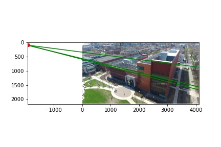
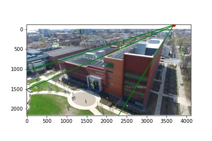
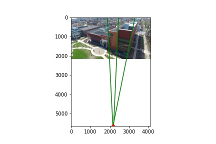
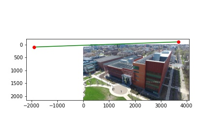

## MP3-Q3 by Jongwon Lee (jongwon5)

## **Vanishing Points [5 pts].**

### Implementation

Given a set of 2D line coefficients (i.e. $a$, $b$, $c$ in $ax + by + c = 0$), the vanishing point can be obtained by formulating a corresponding least-square problem. The detailed implementations is as below:

```
def get_vanishing_point(lines):
    """
    Solves for the vanishing point using the user-input lines.
    Inputs:
        lines: np.ndarray of shape (3, N)
            where each column denotes the parameters of the line equation (i.e. coefficients in $ax + by + c = 0$)
    Returns:
        vp: np.ndarray of shape (3, )
            where the 2d vanishing point in homogeneous coordinate obtained by least-square solution among N lines
    """
    _, N = lines.shape

    A = np.empty((N, 3))
    for i in range(N):
        A[i, :] = lines[:, i]
    
    U, S, V = np.linalg.svd(A)
    vp = np.reshape(V[-1, :], (3,))
    
    vp /= vp[-1]

    return vp
```

### Results

Assuming that we already have a set of coefficient as `all_lines`, the lines and the estimated vanishing point can be shown in the same image.

```
# Part (1)
# Computing vanishing points for each of the directions
vpts = np.zeros((3, num_vpts))

for i in range(num_vpts):
    fig = plt.figure(); ax = fig.gca()
    
    # <YOUR CODE> Solve for vanishing point
    vpts[:, i] = get_vanishing_point(all_lines[i])
    print(f"vanishing point {i}: ", vpts[:2, i])
    
    # Plot the lines and the vanishing point
    plot_lines_and_vp(ax, im, all_lines[i], vpts[:, i])
    fig.savefig('Q3_vp{:d}.pdf'.format(i), bbox_inches='tight')
    fig.savefig('Q3_vp{:d}.jpg'.format(i))
```

By running the script above, the 2D vanishing points corresponding along three orthogonal directions and the visualized results are shown like below, which is quite reasonable.

```
vanishing point 0:  [-1910.80224301    93.81311665]
vanishing point 1:  [3679.66328067 -105.84809264]
vanishing point 2:  [2175.82617724 5636.70907416]
```

<div align="center">
  
  
  
</div>

## **Horizon [5 pts].**

### Implementation

The horizon can be obtained by drawing a line connecting two vanishing points excepts for the one in the vertical direction. Note that the resulting coefficients are normalized to be comply with the requirement $a^2 + b^2 = 1$:

```
def get_horizon_line(horizontal_vp0, horizontal_vp1):
    """
    Calculates the ground horizon line.
    Inputs:
        horizontal_vp0: np.ndarray of shape (3, )
            where one horizontal 2d vanishing point in homogeneous coordinate
        horizontal_vp1: np.ndarray of shape (3, )
            where the other horizontal 2d vanishing point in homogeneous coordinate
    Returns:
        horizontal_line: np.ndarray of shape (3, )
            where the coefficients of 2d horizontal line equation ax + by + c = 0 
            with a constraint that a**2 + b**2 = 1
    """
    # normalize 2d vanishing points 
    horizontal_vp0 /= horizontal_vp0[-1]
    horizontal_vp1 /= horizontal_vp1[-1]

    # construct ax + by + c = 0 where coefficients are not normalized
    x0, y0 = horizontal_vp0[:-1]
    x1, y1 = horizontal_vp1[:-1]
    horizontal_line = np.array([(y1 - y0), -(x1 - x0), -x0*y1 + x1*y0])
    
    # force ax + by + c = 0 where a**2 + b**2 = 1
    horizontal_line /= np.linalg.norm(horizontal_line[:-1])
    
    return horizontal_line
```

In addition to this, the function for plotting the horizont is developed as well. 

```
def plot_horizon_line(ax, im, horizontal_line, pt1=None, pt2=None):
    """
    Plots the horizon line.
    Inputs:
        ax: pyplot axis
        im: np.ndarray of shape (height, width, 3)
        horizontal_line: np.ndarray of shape (3, )
            where the coefficients of 2d horizontal line equation ax + by + c = 0 
            which satisfies a**2 + b**2 = 1
        pt1 (optional): np.ndarray of shape (3, )
            where one horizontal 2d vanishing point in homogeneous coordinate
        pt2 (optional): np.ndarray of shape (3, )
            where the other horizontal 2d vanishing point in homogeneous coordinate
    Returns:
    """
    # normalize horizontal_line
    horizontal_line /= np.linalg.norm(horizontal_line[:-1])

    ax.imshow(im)

    if (pt1 is None) or (pt2 is None): 
        # if two horizontal vanishing points are not given, 
        # pt1 for x-intercept and pt2 for y-intercept
        pt1 = np.array([-horizontal_line[2]/horizontal_line[0], 0, 1])
        pt2 = np.array([0, -horizontal_line[2]/horizontal_line[1], 1])
    else:
        # else, normalize them
        pt1 /= pt1[-1]
        pt2 /= pt2[-1]

    # plot horizontal line
    ax.plot([pt1[0], pt2[0]], [pt1[1], pt2[1]], 'g')

    # plot vanishing points or intercepts
    ax.plot(pt1[0], pt1[1], 'ro')
    ax.plot(pt2[0], pt2[1], 'ro')
```

### Results

The horizon can be estimated and drawn by executing the following script: 

```
# Part (2) Computing and plotting the horizon
# <YOUR CODE> Get the ground horizon line
horizon_line = get_horizon_line(vpts[:, 0], vpts[:, 1])
print("horizontal line: ", horizon_line)

# <YOUR CODE> Plot the ground horizon line
fig = plt.figure(); ax = fig.gca()
plot_horizon_line(ax, im, horizon_line, pt1=vpts[:, 0], pt2=vpts[:, 1])
fig.savefig('Q3_horizon.pdf', bbox_inches='tight')
fig.savefig('Q3_horizon.jpg')
```

After then, the line coefficients for the horizon can be obtained as follows. Note that the first and second coefficient are normalized to meet the demand $a^2 + b^2 = 1$.

```
horizontal line:  [-0.03569184 -0.99936284 25.55329752]
```

<div align="center">
  
</div>


## **Camera Calibration [15 pts].**

### Implementation

Thanks to the existence of `sympy` library, a complicated procedure for estimating camera intrinsic parameters from vanishing points on three orthogonal axes can be obtained by properly formulating a symbolic equation and solving it. Below shows the detailed implementation on how to achieve this. Note that the 3 X 3 intrinsic matrix $K$ satisfies the condition $v_{i}^{T} K^{-T} K^{-1} v_{j} = 0$, where $i \neq j$.

```
def get_camera_parameters(vpt_x, vpt_y, vpt_z):
    """
    Computes the camera parameters. Hint: The SymPy package is suitable for this.
    Inputs:
        vpt_x: np.ndarray of shape (3, )
            where horizontal vanishing point toward right in 2d homogeneous coordinate
        vpt_y: np.ndarray of shape (3, )
            where vertical vanishing point downward in 2d homogeneous coordinate
        vpt_z: np.ndarray of shape (3, )
            where horizontal vanishing point toward left in 2d homogeneous coordinate
    Returns:
        f: focal length
        u: principal point along horizontal axis
        v: principal point along vertical axis
        K: np.ndarray of shape (3, 3)
    """
    from sympy import symbols, Matrix, solve, Eq
    f_sym, u_sym, v_sym = symbols('f, u, v')
    K_sym = Matrix([[f_sym,0,u_sym], [0,f_sym,v_sym], [0,0,1]])

    V_left  = np.vstack([vpt_x, vpt_y, vpt_z]).T
    V_right = np.vstack([vpt_y, vpt_z, vpt_x]).T

    res = V_left.T * K_sym.inv().T * K_sym.inv() * V_right
    
    eq0 = Eq(res[0,0], 0)
    eq1 = Eq(res[1,1], 0)
    eq2 = Eq(res[2,2], 0)

    sol = solve([eq0, eq1, eq2], (f_sym, u_sym, v_sym))
    print(K_sym.inv().T * K_sym.inv())
    print(sol)
    f = abs(sol[0][0])
    u = sol[0][1]
    v = sol[0][2]
    K = np.array([[f,0,u], [0,f,v], [0,0,1]], dtype='float')

    return f, u, v, K
```


### Results

The aforementioned calibration procedure can be executed by running the following script:

```
# Part (3) Computing Camera Parameters
# <YOUR CODE> Solve for the camera parameters (f, u, v)
f, u, v, K = get_camera_parameters(vpt_x=vpts[:,1], vpt_y=vpts[:,2], vpt_z=vpts[:,0])
print(f'f: {f:.2f}, u: {u:.2f}, v: {v:.2f}')
print('K: \n', K)
```

It yields the following results.

```
[(-2296.55057471669, 2014.57714556580, 1121.77522448985)]
f: 2296.55, u: 2014.58, v: 1121.78
K: 
 [[2.29655057e+03 0.00000000e+00 2.01457715e+03]
 [0.00000000e+00 2.29655057e+03 1.12177522e+03]
 [0.00000000e+00 0.00000000e+00 1.00000000e+00]]
```

We cannot sure that whether these are values supposed to be achieve. Therefore, we reconstruct the relationship $v_{i}^{T} K^{-T} K^{-1} v_{j} = 0$, where $i \neq j$ for a simple sanity check.

```
# sanity check for whether the estimated intrinsic parameters are valid; the matrix multiplication should be minimized as much as possible
K_invT_K_inv = np.array([[f**(-2), 0, -u/f**2], 
                          [0, f**(-2), -v/f**2],
                          [-u/f**2, -v/f**2, 1 + u**2/f**2 + v**2/f**2]])
print('test 1: ', vpts[:,0][np.newaxis, :] @ K_invT_K_inv @ vpts[:,1])
print('test 2: ', vpts[:,1][np.newaxis, :] @ K_invT_K_inv @ vpts[:,2])
print('test 3: ', vpts[:,2][np.newaxis, :] @ K_invT_K_inv @ vpts[:,0])
```

The outcomes are shown below and there is no doubt on the fact that these are in line with our expectation. Hence, we can conclude that the calibration procedure has been successfully conducted.

```
test 1:  [2.66453525910038e-15]
test 2:  [8.88178419700125e-16]
test 3:  [-1.63064006741820e-15]
```

## **Rotation Matrix [5 pts].**

### Implementation

From the estimated 3X3 intrinsic matrix $K$, we can obtain the 3 X 3 rotation matrix $R$ describing the camera's atitude w.r.t. the imaginary center of world coordinate frame at the intesection of three vanishing lines. As introduced in the lecture material, it can be derived by imposing three different 2D-3D relationship between the pairs of vanishing point (2D) and its direction (3D).

```
def get_rotation_matrix(vpt_x, vpt_y, vpt_z, K):
    """
    Computes the rotation matrix using the camera parameters.
    Inputs:
        vpt_x: np.ndarray of shape (3, )
            where horizontal vanishing point toward right in 2d homogeneous coordinate
        vpt_y: np.ndarray of shape (3, )
            where vertical vanishing point downward in 2d homogeneous coordinate
        vpt_z: np.ndarray of shape (3, )
            where horizontal vanishing point toward left in 2d homogeneous coordinate
        K: np.ndarray of shape (3, 3)
    Returns:
        R: np.ndarray of shape (3, 3)
            rotation matrix, whose column vectors' norms are equal to 1
    """
    # calculate unnormalized rotation matrix
    r1_raw = np.linalg.inv(K) @ vpt_x[:,np.newaxis]
    r2_raw = np.linalg.inv(K) @ vpt_y[:,np.newaxis]
    r3_raw = np.linalg.inv(K) @ vpt_z[:,np.newaxis]
    
    # normalize columnwise
    r1 = r1_raw / np.linalg.norm(r1_raw)
    r2 = r2_raw / np.linalg.norm(r2_raw)
    r3 = r3_raw / np.linalg.norm(r3_raw)

    R = np.hstack([r1,r2,r3])

    return R
```


### Results

The aforementioned calibration procedure can be executed by running the following script:

```
# Part (4) Computing Rotation Matrices
# <YOUR CODE> Solve for the rotation matrix
R = get_rotation_matrix(vpt_x=vpts[:,1], vpt_y=vpts[:,2], vpt_z=vpts[:,0], K=K)
print('R: \n', R)
```

It yields the following results.

```
R: 
 [[ 0.53870444  0.031817   -0.84189382]
 [-0.39717232  0.89086833 -0.22047167]
 [ 0.7430018   0.45314599  0.49255156]]
```

We cannot sure that whether it is the *authentic* 3D rotation matrix supposed to be achieve. Therefore, investigate whether it is true or not for a simple sanity check, by exploiting the property $R^{T}R = I$ and $det(R) = 1$.


```
# sanity check for whether R is orthonormal
def isRotationMatrix(M, eps=0.01):
    I = np.identity(M.shape[0])
    if np.all(np.around(M @ M.T) == I) and (np.linalg.det(M)-1 < eps): 
        print('R is a rotation matrix.')
        return True
    else: 
        print('R is not a rotation matrix.')
        return False

isRotationMatrix(R)
```

As a result, it has been observed that the aforementioned scripts returns True. Hence, we ensure that the rotation matrix has been estimated appropriately.

```
R is a rotation matrix.
```


## **Extra Credits [5 pts].**
